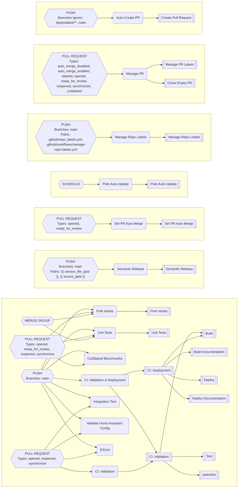

# GitHub Config Files

## Repository File Mappings

### All Mappings

| Destination | [worganisation/esphome](https://github.com/worganisation/esphome) | [worganisation/frigate-config](https://github.com/worganisation/frigate-config) | [worganisation/home-assistant](https://github.com/worganisation/home-assistant) | [worganisation/home-assistant-appdaemon](https://github.com/worganisation/home-assistant-appdaemon) | [worganisation/home-assistant-config-validator](https://github.com/worganisation/home-assistant-config-validator) | [worganisation/infrastructure](https://github.com/worganisation/infrastructure) | [worganisation/led-matrix-controller](https://github.com/worganisation/led-matrix-controller) | [worganisation/pre-commit-hooks-dependency-sync](https://github.com/worganisation/pre-commit-hooks-dependency-sync) | [worganisation/smart-mini-crt-interface](https://github.com/worganisation/smart-mini-crt-interface) | [worganisation/very-slow-movie-player](https://github.com/worganisation/very-slow-movie-player) | [worganisation/wg-scripts](https://github.com/worganisation/wg-scripts) | [worganisation/wg-utilities](https://github.com/worganisation/wg-utilities) | [addon-item-warehouse-api](https://github.com/worgarside/addon-item-warehouse-api) | [addon-item-warehouse-website](https://github.com/worgarside/addon-item-warehouse-website) | [addon-yas-209-bridge](https://github.com/worgarside/addon-yas-209-bridge) | [plant-monitor](https://github.com/worgarside/plant-monitor) | [python-template](https://github.com/worgarside/python-template) |
|-------------|--------|--------|--------|--------|--------|--------|--------|--------|--------|--------|--------|--------|--------|--------|--------|--------|--------|
| **.github/CODEOWNERS** | [.github/CODEOWNERS](.github/CODEOWNERS) | | [.github/CODEOWNERS](.github/CODEOWNERS) | [.github/CODEOWNERS](.github/CODEOWNERS) | [.github/CODEOWNERS](.github/CODEOWNERS) | | [.github/CODEOWNERS](.github/CODEOWNERS) | [.github/CODEOWNERS](.github/CODEOWNERS) | [.github/CODEOWNERS](.github/CODEOWNERS) | [.github/CODEOWNERS](.github/CODEOWNERS) | [.github/CODEOWNERS](.github/CODEOWNERS) | [.github/CODEOWNERS](.github/CODEOWNERS) | [.github/CODEOWNERS](.github/CODEOWNERS) | [.github/CODEOWNERS](.github/CODEOWNERS) | [.github/CODEOWNERS](.github/CODEOWNERS) | [.github/CODEOWNERS](.github/CODEOWNERS) | [.github/CODEOWNERS](.github/CODEOWNERS) |
| **.github/dependabot.yml** | [.github/dependabot.yml](.github/dependabot.yml) | | [.github/dependabot.yml](.github/dependabot.yml) | [.github/dependabot.yml](.github/dependabot.yml) | [.github/dependabot.yml](.github/dependabot.yml) | | [.github/dependabot.yml](.github/dependabot.yml) | [.github/dependabot.yml](.github/dependabot.yml) | [.github/dependabot.yml](.github/dependabot.yml) | [.github/dependabot.yml](.github/dependabot.yml) | [.github/dependabot.yml](.github/dependabot.yml) | [.github/dependabot.yml](.github/dependabot.yml) | [.github/dependabot.yml](.github/dependabot.yml) | [.github/dependabot.yml](.github/dependabot.yml) | [.github/dependabot.yml](.github/dependabot.yml) | [.github/dependabot.yml](.github/dependabot.yml) | [.github/dependabot.yml](.github/dependabot.yml) |
| **.github/labeler.yml** | [.github/labeler.yml](.github/labeler.yml) | | | [.github/labeler.yml](.github/labeler.yml) | [.github/labeler.yml](.github/labeler.yml) | | [.github/labeler.yml](.github/labeler.yml) | [.github/labeler.yml](.github/labeler.yml) | [.github/labeler.yml](.github/labeler.yml) | [.github/labeler.yml](.github/labeler.yml) | [.github/labeler.yml](.github/labeler.yml) | [.github/labeler.yml](.github/labeler.yml) | [.github/labeler.yml](.github/labeler.yml) | [.github/labeler.yml](.github/labeler.yml) | [.github/labeler.yml](.github/labeler.yml) | [.github/labeler.yml](.github/labeler.yml) | [.github/labeler.yml](.github/labeler.yml) |
| **.github/release-drafter.yml** | | | | | | | | | [gha_sync/configs/release-drafter.yml](gha_sync/configs/release-drafter.yml) | [gha_sync/configs/release-drafter.yml](gha_sync/configs/release-drafter.yml) | | | [gha_sync/configs/release-drafter.yml](gha_sync/configs/release-drafter.yml) | [gha_sync/configs/release-drafter.yml](gha_sync/configs/release-drafter.yml) | [gha_sync/configs/release-drafter.yml](gha_sync/configs/release-drafter.yml) | | [gha_sync/configs/release-drafter.yml](gha_sync/configs/release-drafter.yml) |
| **.github/repo_labels.yml** | [.github/repo_labels.yml](.github/repo_labels.yml) | | | [.github/repo_labels.yml](.github/repo_labels.yml) | [.github/repo_labels.yml](.github/repo_labels.yml) | | [.github/repo_labels.yml](.github/repo_labels.yml) | [.github/repo_labels.yml](.github/repo_labels.yml) | [.github/repo_labels.yml](.github/repo_labels.yml) | [.github/repo_labels.yml](.github/repo_labels.yml) | [.github/repo_labels.yml](.github/repo_labels.yml) | [.github/repo_labels.yml](.github/repo_labels.yml) | [.github/repo_labels.yml](.github/repo_labels.yml) | [.github/repo_labels.yml](.github/repo_labels.yml) | [.github/repo_labels.yml](.github/repo_labels.yml) | [.github/repo_labels.yml](.github/repo_labels.yml) | [.github/repo_labels.yml](.github/repo_labels.yml) |
| **.github/workflows/auto-create-pr.yml** | [gha_sync/workflows/all/auto-create-pr.yml](gha_sync/workflows/all/auto-create-pr.yml) | [gha_sync/workflows/all/auto-create-pr.yml](gha_sync/workflows/all/auto-create-pr.yml) | [gha_sync/workflows/all/auto-create-pr.yml](gha_sync/workflows/all/auto-create-pr.yml) | [gha_sync/workflows/all/auto-create-pr.yml](gha_sync/workflows/all/auto-create-pr.yml) | [gha_sync/workflows/all/auto-create-pr.yml](gha_sync/workflows/all/auto-create-pr.yml) | [gha_sync/workflows/all/auto-create-pr.yml](gha_sync/workflows/all/auto-create-pr.yml) | [gha_sync/workflows/all/auto-create-pr.yml](gha_sync/workflows/all/auto-create-pr.yml) | [gha_sync/workflows/all/auto-create-pr.yml](gha_sync/workflows/all/auto-create-pr.yml) | [gha_sync/workflows/all/auto-create-pr.yml](gha_sync/workflows/all/auto-create-pr.yml) | [gha_sync/workflows/all/auto-create-pr.yml](gha_sync/workflows/all/auto-create-pr.yml) | [gha_sync/workflows/all/auto-create-pr.yml](gha_sync/workflows/all/auto-create-pr.yml) | [gha_sync/workflows/all/auto-create-pr.yml](gha_sync/workflows/all/auto-create-pr.yml) | [gha_sync/workflows/all/auto-create-pr.yml](gha_sync/workflows/all/auto-create-pr.yml) | [gha_sync/workflows/all/auto-create-pr.yml](gha_sync/workflows/all/auto-create-pr.yml) | [gha_sync/workflows/all/auto-create-pr.yml](gha_sync/workflows/all/auto-create-pr.yml) | [gha_sync/workflows/all/auto-create-pr.yml](gha_sync/workflows/all/auto-create-pr.yml) | [gha_sync/workflows/all/auto-create-pr.yml](gha_sync/workflows/all/auto-create-pr.yml) |
| **.github/workflows/ci_deployment.yml** | | | | | | | | | [gha_sync/workflows/template/ci_deployment.template.yml](gha_sync/workflows/template/ci_deployment.template.yml) | [gha_sync/workflows/template/ci_deployment.template.yml](gha_sync/workflows/template/ci_deployment.template.yml) | | | [gha_sync/workflows/template/ci_deployment.template.yml](gha_sync/workflows/template/ci_deployment.template.yml) | [gha_sync/workflows/template/ci_deployment.template.yml](gha_sync/workflows/template/ci_deployment.template.yml) | [gha_sync/workflows/template/ci_deployment.template.yml](gha_sync/workflows/template/ci_deployment.template.yml) | | [gha_sync/workflows/template/ci_deployment.template.yml](gha_sync/workflows/template/ci_deployment.template.yml) |
| **.github/workflows/ci_validation.yml** | | | | | | | | | [gha_sync/workflows/template/ci_validation.template.yml](gha_sync/workflows/template/ci_validation.template.yml) | [gha_sync/workflows/template/ci_validation.template.yml](gha_sync/workflows/template/ci_validation.template.yml) | | | [gha_sync/workflows/template/ci_validation.template.yml](gha_sync/workflows/template/ci_validation.template.yml) | [gha_sync/workflows/template/ci_validation.template.yml](gha_sync/workflows/template/ci_validation.template.yml) | [gha_sync/workflows/template/ci_validation.template.yml](gha_sync/workflows/template/ci_validation.template.yml) | | [gha_sync/workflows/template/ci_validation.template.yml](gha_sync/workflows/template/ci_validation.template.yml) |
| **.github/workflows/codspeed.yml** | | | | | [gha_sync/workflows/template/codspeed.template.yml](gha_sync/workflows/template/codspeed.template.yml) | | [gha_sync/workflows/template/codspeed.template.yml](gha_sync/workflows/template/codspeed.template.yml) | | | | | | | | | | |
| **.github/workflows/eslint.yml** | | | | | | | | | | | | | | [gha_sync/workflows/repo/addon-item-warehouse-website/eslint.yml](gha_sync/workflows/repo/addon-item-warehouse-website/eslint.yml) | | | |
| **.github/workflows/integration-test.yml** | | | | | [gha_sync/workflows/repo/home-assistant-config-validator/integration-test.yml](gha_sync/workflows/repo/home-assistant-config-validator/integration-test.yml) | | | | | | | | | | | | |
| **.github/workflows/manage-pr.yml** | [gha_sync/workflows/all/manage-pr.yml](gha_sync/workflows/all/manage-pr.yml) | | [gha_sync/workflows/all/manage-pr.yml](gha_sync/workflows/all/manage-pr.yml) | [gha_sync/workflows/all/manage-pr.yml](gha_sync/workflows/all/manage-pr.yml) | [gha_sync/workflows/all/manage-pr.yml](gha_sync/workflows/all/manage-pr.yml) | | [gha_sync/workflows/all/manage-pr.yml](gha_sync/workflows/all/manage-pr.yml) | [gha_sync/workflows/all/manage-pr.yml](gha_sync/workflows/all/manage-pr.yml) | [gha_sync/workflows/all/manage-pr.yml](gha_sync/workflows/all/manage-pr.yml) | [gha_sync/workflows/all/manage-pr.yml](gha_sync/workflows/all/manage-pr.yml) | [gha_sync/workflows/all/manage-pr.yml](gha_sync/workflows/all/manage-pr.yml) | [gha_sync/workflows/all/manage-pr.yml](gha_sync/workflows/all/manage-pr.yml) | [gha_sync/workflows/all/manage-pr.yml](gha_sync/workflows/all/manage-pr.yml) | [gha_sync/workflows/all/manage-pr.yml](gha_sync/workflows/all/manage-pr.yml) | [gha_sync/workflows/all/manage-pr.yml](gha_sync/workflows/all/manage-pr.yml) | [gha_sync/workflows/all/manage-pr.yml](gha_sync/workflows/all/manage-pr.yml) | [gha_sync/workflows/all/manage-pr.yml](gha_sync/workflows/all/manage-pr.yml) |
| **.github/workflows/manage-repo-labels.yml** | [gha_sync/workflows/all/manage-repo-labels.yml](gha_sync/workflows/all/manage-repo-labels.yml) | | [gha_sync/workflows/all/manage-repo-labels.yml](gha_sync/workflows/all/manage-repo-labels.yml) | [gha_sync/workflows/all/manage-repo-labels.yml](gha_sync/workflows/all/manage-repo-labels.yml) | [gha_sync/workflows/all/manage-repo-labels.yml](gha_sync/workflows/all/manage-repo-labels.yml) | | [gha_sync/workflows/all/manage-repo-labels.yml](gha_sync/workflows/all/manage-repo-labels.yml) | [gha_sync/workflows/all/manage-repo-labels.yml](gha_sync/workflows/all/manage-repo-labels.yml) | [gha_sync/workflows/all/manage-repo-labels.yml](gha_sync/workflows/all/manage-repo-labels.yml) | [gha_sync/workflows/all/manage-repo-labels.yml](gha_sync/workflows/all/manage-repo-labels.yml) | [gha_sync/workflows/all/manage-repo-labels.yml](gha_sync/workflows/all/manage-repo-labels.yml) | [gha_sync/workflows/all/manage-repo-labels.yml](gha_sync/workflows/all/manage-repo-labels.yml) | [gha_sync/workflows/all/manage-repo-labels.yml](gha_sync/workflows/all/manage-repo-labels.yml) | [gha_sync/workflows/all/manage-repo-labels.yml](gha_sync/workflows/all/manage-repo-labels.yml) | [gha_sync/workflows/all/manage-repo-labels.yml](gha_sync/workflows/all/manage-repo-labels.yml) | [gha_sync/workflows/all/manage-repo-labels.yml](gha_sync/workflows/all/manage-repo-labels.yml) | [gha_sync/workflows/all/manage-repo-labels.yml](gha_sync/workflows/all/manage-repo-labels.yml) |
| **.github/workflows/prek-autoupdate.yml** | [gha_sync/workflows/all/prek-autoupdate.yml](gha_sync/workflows/all/prek-autoupdate.yml) | | [gha_sync/workflows/all/prek-autoupdate.yml](gha_sync/workflows/all/prek-autoupdate.yml) | [gha_sync/workflows/all/prek-autoupdate.yml](gha_sync/workflows/all/prek-autoupdate.yml) | [gha_sync/workflows/all/prek-autoupdate.yml](gha_sync/workflows/all/prek-autoupdate.yml) | | [gha_sync/workflows/all/prek-autoupdate.yml](gha_sync/workflows/all/prek-autoupdate.yml) | [gha_sync/workflows/all/prek-autoupdate.yml](gha_sync/workflows/all/prek-autoupdate.yml) | | | [gha_sync/workflows/all/prek-autoupdate.yml](gha_sync/workflows/all/prek-autoupdate.yml) | [gha_sync/workflows/all/prek-autoupdate.yml](gha_sync/workflows/all/prek-autoupdate.yml) | | | | [gha_sync/workflows/all/prek-autoupdate.yml](gha_sync/workflows/all/prek-autoupdate.yml) | |
| **.github/workflows/prek-hooks.yml** | [gha_sync/workflows/template/prek-hooks.template.yml](gha_sync/workflows/template/prek-hooks.template.yml) | | [gha_sync/workflows/template/prek-hooks.template.yml](gha_sync/workflows/template/prek-hooks.template.yml) | [gha_sync/workflows/template/prek-hooks.template.yml](gha_sync/workflows/template/prek-hooks.template.yml) | [gha_sync/workflows/template/prek-hooks.template.yml](gha_sync/workflows/template/prek-hooks.template.yml) | | [gha_sync/workflows/repo/led-matrix-controller/prek-hooks.yml](gha_sync/workflows/repo/led-matrix-controller/prek-hooks.yml) | [gha_sync/workflows/template/prek-hooks.template.yml](gha_sync/workflows/template/prek-hooks.template.yml) | | | [gha_sync/workflows/template/prek-hooks.template.yml](gha_sync/workflows/template/prek-hooks.template.yml) | [gha_sync/workflows/template/prek-hooks.template.yml](gha_sync/workflows/template/prek-hooks.template.yml) | | | | [gha_sync/workflows/template/prek-hooks.template.yml](gha_sync/workflows/template/prek-hooks.template.yml) | |
| **.github/workflows/semantic-release.yml** | | | | [gha_sync/workflows/template/semantic-release.template.yml](gha_sync/workflows/template/semantic-release.template.yml) | [gha_sync/workflows/template/semantic-release.template.yml](gha_sync/workflows/template/semantic-release.template.yml) | | | [gha_sync/workflows/template/semantic-release.template.yml](gha_sync/workflows/template/semantic-release.template.yml) | | | [gha_sync/workflows/template/semantic-release.template.yml](gha_sync/workflows/template/semantic-release.template.yml) | | | | | [gha_sync/workflows/template/semantic-release.template.yml](gha_sync/workflows/template/semantic-release.template.yml) | |
| **.github/workflows/set-pr-auto-merge.yml** | [gha_sync/workflows/all/set-pr-auto-merge.yml](gha_sync/workflows/all/set-pr-auto-merge.yml) | | [gha_sync/workflows/all/set-pr-auto-merge.yml](gha_sync/workflows/all/set-pr-auto-merge.yml) | [gha_sync/workflows/all/set-pr-auto-merge.yml](gha_sync/workflows/all/set-pr-auto-merge.yml) | [gha_sync/workflows/all/set-pr-auto-merge.yml](gha_sync/workflows/all/set-pr-auto-merge.yml) | | [gha_sync/workflows/all/set-pr-auto-merge.yml](gha_sync/workflows/all/set-pr-auto-merge.yml) | [gha_sync/workflows/all/set-pr-auto-merge.yml](gha_sync/workflows/all/set-pr-auto-merge.yml) | [gha_sync/workflows/all/set-pr-auto-merge.yml](gha_sync/workflows/all/set-pr-auto-merge.yml) | [gha_sync/workflows/all/set-pr-auto-merge.yml](gha_sync/workflows/all/set-pr-auto-merge.yml) | [gha_sync/workflows/all/set-pr-auto-merge.yml](gha_sync/workflows/all/set-pr-auto-merge.yml) | [gha_sync/workflows/all/set-pr-auto-merge.yml](gha_sync/workflows/all/set-pr-auto-merge.yml) | [gha_sync/workflows/all/set-pr-auto-merge.yml](gha_sync/workflows/all/set-pr-auto-merge.yml) | [gha_sync/workflows/all/set-pr-auto-merge.yml](gha_sync/workflows/all/set-pr-auto-merge.yml) | [gha_sync/workflows/all/set-pr-auto-merge.yml](gha_sync/workflows/all/set-pr-auto-merge.yml) | [gha_sync/workflows/all/set-pr-auto-merge.yml](gha_sync/workflows/all/set-pr-auto-merge.yml) | [gha_sync/workflows/all/set-pr-auto-merge.yml](gha_sync/workflows/all/set-pr-auto-merge.yml) |
| **.github/workflows/unit-tests.yml** | | | | | [gha_sync/workflows/template/unit-tests.template.yml](gha_sync/workflows/template/unit-tests.template.yml) | | [gha_sync/workflows/template/unit-tests.template.yml](gha_sync/workflows/template/unit-tests.template.yml) | | | | | [gha_sync/workflows/template/unit-tests.template.yml](gha_sync/workflows/template/unit-tests.template.yml) | | | | | |
| **.github/workflows/validate-home-assistant-config.yml** | | | [gha_sync/workflows/repo/home-assistant/validate-home-assistant-config.yml](gha_sync/workflows/repo/home-assistant/validate-home-assistant-config.yml) | | | | | | | | | | | | | | |
| **.yamllint** | [.yamllint](.yamllint) | | | [.yamllint](.yamllint) | [.yamllint](.yamllint) | | [.yamllint](.yamllint) | [.yamllint](.yamllint) | [.yamllint](.yamllint) | [.yamllint](.yamllint) | [.yamllint](.yamllint) | | [.yamllint](.yamllint) | | [.yamllint](.yamllint) | [.yamllint](.yamllint) | [.yamllint](.yamllint) |
### Per-Repository Mappings

### [worganisation/esphome](https://github.com/worganisation/esphome) (11 files)

Mapping Table

| Source | Destination |
|--------|-------------|
| [.github/CODEOWNERS](.github/CODEOWNERS) | [.github/CODEOWNERS](https://github.com/worganisation/esphome/.github/CODEOWNERS) |
| [.github/dependabot.yml](.github/dependabot.yml) | [.github/dependabot.yml](https://github.com/worganisation/esphome/.github/dependabot.yml) |
| [.github/labeler.yml](.github/labeler.yml) | [.github/labeler.yml](https://github.com/worganisation/esphome/.github/labeler.yml) |
| [.github/repo_labels.yml](.github/repo_labels.yml) | [.github/repo_labels.yml](https://github.com/worganisation/esphome/.github/repo_labels.yml) |
| [.yamllint](.yamllint) | [.yamllint](https://github.com/worganisation/esphome/.yamllint) |
| [gha_sync/workflows/all/auto-create-pr.yml](gha_sync/workflows/all/auto-create-pr.yml) | [.github/workflows/auto-create-pr.yml](https://github.com/worganisation/esphome/.github/workflows/auto-create-pr.yml) |
| [gha_sync/workflows/all/manage-pr.yml](gha_sync/workflows/all/manage-pr.yml) | [.github/workflows/manage-pr.yml](https://github.com/worganisation/esphome/.github/workflows/manage-pr.yml) |
| [gha_sync/workflows/all/manage-repo-labels.yml](gha_sync/workflows/all/manage-repo-labels.yml) | [.github/workflows/manage-repo-labels.yml](https://github.com/worganisation/esphome/.github/workflows/manage-repo-labels.yml) |
| [gha_sync/workflows/all/prek-autoupdate.yml](gha_sync/workflows/all/prek-autoupdate.yml) | [.github/workflows/prek-autoupdate.yml](https://github.com/worganisation/esphome/.github/workflows/prek-autoupdate.yml) |
| [gha_sync/workflows/all/set-pr-auto-merge.yml](gha_sync/workflows/all/set-pr-auto-merge.yml) | [.github/workflows/set-pr-auto-merge.yml](https://github.com/worganisation/esphome/.github/workflows/set-pr-auto-merge.yml) |
| [gha_sync/workflows/template/prek-hooks.template.yml](gha_sync/workflows/template/prek-hooks.template.yml) | [.github/workflows/prek-hooks.yml](https://github.com/worganisation/esphome/.github/workflows/prek-hooks.yml) |

### [worganisation/frigate-config](https://github.com/worganisation/frigate-config) (1 files)

Mapping Table

| Source | Destination |
|--------|-------------|
| [gha_sync/workflows/all/auto-create-pr.yml](gha_sync/workflows/all/auto-create-pr.yml) | [.github/workflows/auto-create-pr.yml](https://github.com/worganisation/frigate-config/.github/workflows/auto-create-pr.yml) |

### [worganisation/home-assistant](https://github.com/worganisation/home-assistant) (9 files)

Mapping Table

| Source | Destination |
|--------|-------------|
| [.github/CODEOWNERS](.github/CODEOWNERS) | [.github/CODEOWNERS](https://github.com/worganisation/home-assistant/.github/CODEOWNERS) |
| [.github/dependabot.yml](.github/dependabot.yml) | [.github/dependabot.yml](https://github.com/worganisation/home-assistant/.github/dependabot.yml) |
| [gha_sync/workflows/all/auto-create-pr.yml](gha_sync/workflows/all/auto-create-pr.yml) | [.github/workflows/auto-create-pr.yml](https://github.com/worganisation/home-assistant/.github/workflows/auto-create-pr.yml) |
| [gha_sync/workflows/all/manage-pr.yml](gha_sync/workflows/all/manage-pr.yml) | [.github/workflows/manage-pr.yml](https://github.com/worganisation/home-assistant/.github/workflows/manage-pr.yml) |
| [gha_sync/workflows/all/manage-repo-labels.yml](gha_sync/workflows/all/manage-repo-labels.yml) | [.github/workflows/manage-repo-labels.yml](https://github.com/worganisation/home-assistant/.github/workflows/manage-repo-labels.yml) |
| [gha_sync/workflows/all/prek-autoupdate.yml](gha_sync/workflows/all/prek-autoupdate.yml) | [.github/workflows/prek-autoupdate.yml](https://github.com/worganisation/home-assistant/.github/workflows/prek-autoupdate.yml) |
| [gha_sync/workflows/all/set-pr-auto-merge.yml](gha_sync/workflows/all/set-pr-auto-merge.yml) | [.github/workflows/set-pr-auto-merge.yml](https://github.com/worganisation/home-assistant/.github/workflows/set-pr-auto-merge.yml) |
| [gha_sync/workflows/repo/home-assistant/validate-home-assistant-config.yml](gha_sync/workflows/repo/home-assistant/validate-home-assistant-config.yml) | [.github/workflows/validate-home-assistant-config.yml](https://github.com/worganisation/home-assistant/.github/workflows/validate-home-assistant-config.yml) |
| [gha_sync/workflows/template/prek-hooks.template.yml](gha_sync/workflows/template/prek-hooks.template.yml) | [.github/workflows/prek-hooks.yml](https://github.com/worganisation/home-assistant/.github/workflows/prek-hooks.yml) |

### [worganisation/home-assistant-appdaemon](https://github.com/worganisation/home-assistant-appdaemon) (12 files)

Mapping Table

| Source | Destination |
|--------|-------------|
| [.github/CODEOWNERS](.github/CODEOWNERS) | [.github/CODEOWNERS](https://github.com/worganisation/home-assistant-appdaemon/.github/CODEOWNERS) |
| [.github/dependabot.yml](.github/dependabot.yml) | [.github/dependabot.yml](https://github.com/worganisation/home-assistant-appdaemon/.github/dependabot.yml) |
| [.github/labeler.yml](.github/labeler.yml) | [.github/labeler.yml](https://github.com/worganisation/home-assistant-appdaemon/.github/labeler.yml) |
| [.github/repo_labels.yml](.github/repo_labels.yml) | [.github/repo_labels.yml](https://github.com/worganisation/home-assistant-appdaemon/.github/repo_labels.yml) |
| [.yamllint](.yamllint) | [.yamllint](https://github.com/worganisation/home-assistant-appdaemon/.yamllint) |
| [gha_sync/workflows/all/auto-create-pr.yml](gha_sync/workflows/all/auto-create-pr.yml) | [.github/workflows/auto-create-pr.yml](https://github.com/worganisation/home-assistant-appdaemon/.github/workflows/auto-create-pr.yml) |
| [gha_sync/workflows/all/manage-pr.yml](gha_sync/workflows/all/manage-pr.yml) | [.github/workflows/manage-pr.yml](https://github.com/worganisation/home-assistant-appdaemon/.github/workflows/manage-pr.yml) |
| [gha_sync/workflows/all/manage-repo-labels.yml](gha_sync/workflows/all/manage-repo-labels.yml) | [.github/workflows/manage-repo-labels.yml](https://github.com/worganisation/home-assistant-appdaemon/.github/workflows/manage-repo-labels.yml) |
| [gha_sync/workflows/all/prek-autoupdate.yml](gha_sync/workflows/all/prek-autoupdate.yml) | [.github/workflows/prek-autoupdate.yml](https://github.com/worganisation/home-assistant-appdaemon/.github/workflows/prek-autoupdate.yml) |
| [gha_sync/workflows/all/set-pr-auto-merge.yml](gha_sync/workflows/all/set-pr-auto-merge.yml) | [.github/workflows/set-pr-auto-merge.yml](https://github.com/worganisation/home-assistant-appdaemon/.github/workflows/set-pr-auto-merge.yml) |
| [gha_sync/workflows/template/prek-hooks.template.yml](gha_sync/workflows/template/prek-hooks.template.yml) | [.github/workflows/prek-hooks.yml](https://github.com/worganisation/home-assistant-appdaemon/.github/workflows/prek-hooks.yml) |
| [gha_sync/workflows/template/semantic-release.template.yml](gha_sync/workflows/template/semantic-release.template.yml) | [.github/workflows/semantic-release.yml](https://github.com/worganisation/home-assistant-appdaemon/.github/workflows/semantic-release.yml) |

### [worganisation/home-assistant-config-validator](https://github.com/worganisation/home-assistant-config-validator) (15 files)

Mapping Table

| Source | Destination |
|--------|-------------|
| [.github/CODEOWNERS](.github/CODEOWNERS) | [.github/CODEOWNERS](https://github.com/worganisation/home-assistant-config-validator/.github/CODEOWNERS) |
| [.github/dependabot.yml](.github/dependabot.yml) | [.github/dependabot.yml](https://github.com/worganisation/home-assistant-config-validator/.github/dependabot.yml) |
| [.github/labeler.yml](.github/labeler.yml) | [.github/labeler.yml](https://github.com/worganisation/home-assistant-config-validator/.github/labeler.yml) |
| [.github/repo_labels.yml](.github/repo_labels.yml) | [.github/repo_labels.yml](https://github.com/worganisation/home-assistant-config-validator/.github/repo_labels.yml) |
| [.yamllint](.yamllint) | [.yamllint](https://github.com/worganisation/home-assistant-config-validator/.yamllint) |
| [gha_sync/workflows/all/auto-create-pr.yml](gha_sync/workflows/all/auto-create-pr.yml) | [.github/workflows/auto-create-pr.yml](https://github.com/worganisation/home-assistant-config-validator/.github/workflows/auto-create-pr.yml) |
| [gha_sync/workflows/all/manage-pr.yml](gha_sync/workflows/all/manage-pr.yml) | [.github/workflows/manage-pr.yml](https://github.com/worganisation/home-assistant-config-validator/.github/workflows/manage-pr.yml) |
| [gha_sync/workflows/all/manage-repo-labels.yml](gha_sync/workflows/all/manage-repo-labels.yml) | [.github/workflows/manage-repo-labels.yml](https://github.com/worganisation/home-assistant-config-validator/.github/workflows/manage-repo-labels.yml) |
| [gha_sync/workflows/all/prek-autoupdate.yml](gha_sync/workflows/all/prek-autoupdate.yml) | [.github/workflows/prek-autoupdate.yml](https://github.com/worganisation/home-assistant-config-validator/.github/workflows/prek-autoupdate.yml) |
| [gha_sync/workflows/all/set-pr-auto-merge.yml](gha_sync/workflows/all/set-pr-auto-merge.yml) | [.github/workflows/set-pr-auto-merge.yml](https://github.com/worganisation/home-assistant-config-validator/.github/workflows/set-pr-auto-merge.yml) |
| [gha_sync/workflows/repo/home-assistant-config-validator/integration-test.yml](gha_sync/workflows/repo/home-assistant-config-validator/integration-test.yml) | [.github/workflows/integration-test.yml](https://github.com/worganisation/home-assistant-config-validator/.github/workflows/integration-test.yml) |
| [gha_sync/workflows/template/codspeed.template.yml](gha_sync/workflows/template/codspeed.template.yml) | [.github/workflows/codspeed.yml](https://github.com/worganisation/home-assistant-config-validator/.github/workflows/codspeed.yml) |
| [gha_sync/workflows/template/prek-hooks.template.yml](gha_sync/workflows/template/prek-hooks.template.yml) | [.github/workflows/prek-hooks.yml](https://github.com/worganisation/home-assistant-config-validator/.github/workflows/prek-hooks.yml) |
| [gha_sync/workflows/template/semantic-release.template.yml](gha_sync/workflows/template/semantic-release.template.yml) | [.github/workflows/semantic-release.yml](https://github.com/worganisation/home-assistant-config-validator/.github/workflows/semantic-release.yml) |
| [gha_sync/workflows/template/unit-tests.template.yml](gha_sync/workflows/template/unit-tests.template.yml) | [.github/workflows/unit-tests.yml](https://github.com/worganisation/home-assistant-config-validator/.github/workflows/unit-tests.yml) |

### [worganisation/infrastructure](https://github.com/worganisation/infrastructure) (1 files)

Mapping Table

| Source | Destination |
|--------|-------------|
| [gha_sync/workflows/all/auto-create-pr.yml](gha_sync/workflows/all/auto-create-pr.yml) | [.github/workflows/auto-create-pr.yml](https://github.com/worganisation/infrastructure/.github/workflows/auto-create-pr.yml) |

### [worganisation/led-matrix-controller](https://github.com/worganisation/led-matrix-controller) (13 files)

Mapping Table

| Source | Destination |
|--------|-------------|
| [.github/CODEOWNERS](.github/CODEOWNERS) | [.github/CODEOWNERS](https://github.com/worganisation/led-matrix-controller/.github/CODEOWNERS) |
| [.github/dependabot.yml](.github/dependabot.yml) | [.github/dependabot.yml](https://github.com/worganisation/led-matrix-controller/.github/dependabot.yml) |
| [.github/labeler.yml](.github/labeler.yml) | [.github/labeler.yml](https://github.com/worganisation/led-matrix-controller/.github/labeler.yml) |
| [.github/repo_labels.yml](.github/repo_labels.yml) | [.github/repo_labels.yml](https://github.com/worganisation/led-matrix-controller/.github/repo_labels.yml) |
| [.yamllint](.yamllint) | [.yamllint](https://github.com/worganisation/led-matrix-controller/.yamllint) |
| [gha_sync/workflows/all/auto-create-pr.yml](gha_sync/workflows/all/auto-create-pr.yml) | [.github/workflows/auto-create-pr.yml](https://github.com/worganisation/led-matrix-controller/.github/workflows/auto-create-pr.yml) |
| [gha_sync/workflows/all/manage-pr.yml](gha_sync/workflows/all/manage-pr.yml) | [.github/workflows/manage-pr.yml](https://github.com/worganisation/led-matrix-controller/.github/workflows/manage-pr.yml) |
| [gha_sync/workflows/all/manage-repo-labels.yml](gha_sync/workflows/all/manage-repo-labels.yml) | [.github/workflows/manage-repo-labels.yml](https://github.com/worganisation/led-matrix-controller/.github/workflows/manage-repo-labels.yml) |
| [gha_sync/workflows/all/prek-autoupdate.yml](gha_sync/workflows/all/prek-autoupdate.yml) | [.github/workflows/prek-autoupdate.yml](https://github.com/worganisation/led-matrix-controller/.github/workflows/prek-autoupdate.yml) |
| [gha_sync/workflows/all/set-pr-auto-merge.yml](gha_sync/workflows/all/set-pr-auto-merge.yml) | [.github/workflows/set-pr-auto-merge.yml](https://github.com/worganisation/led-matrix-controller/.github/workflows/set-pr-auto-merge.yml) |
| [gha_sync/workflows/repo/led-matrix-controller/prek-hooks.yml](gha_sync/workflows/repo/led-matrix-controller/prek-hooks.yml) | [.github/workflows/prek-hooks.yml](https://github.com/worganisation/led-matrix-controller/.github/workflows/prek-hooks.yml) |
| [gha_sync/workflows/template/codspeed.template.yml](gha_sync/workflows/template/codspeed.template.yml) | [.github/workflows/codspeed.yml](https://github.com/worganisation/led-matrix-controller/.github/workflows/codspeed.yml) |
| [gha_sync/workflows/template/unit-tests.template.yml](gha_sync/workflows/template/unit-tests.template.yml) | [.github/workflows/unit-tests.yml](https://github.com/worganisation/led-matrix-controller/.github/workflows/unit-tests.yml) |

### [worganisation/pre-commit-hooks-dependency-sync](https://github.com/worganisation/pre-commit-hooks-dependency-sync) (12 files)

Mapping Table

| Source | Destination |
|--------|-------------|
| [.github/CODEOWNERS](.github/CODEOWNERS) | [.github/CODEOWNERS](https://github.com/worganisation/pre-commit-hooks-dependency-sync/.github/CODEOWNERS) |
| [.github/dependabot.yml](.github/dependabot.yml) | [.github/dependabot.yml](https://github.com/worganisation/pre-commit-hooks-dependency-sync/.github/dependabot.yml) |
| [.github/labeler.yml](.github/labeler.yml) | [.github/labeler.yml](https://github.com/worganisation/pre-commit-hooks-dependency-sync/.github/labeler.yml) |
| [.github/repo_labels.yml](.github/repo_labels.yml) | [.github/repo_labels.yml](https://github.com/worganisation/pre-commit-hooks-dependency-sync/.github/repo_labels.yml) |
| [.yamllint](.yamllint) | [.yamllint](https://github.com/worganisation/pre-commit-hooks-dependency-sync/.yamllint) |
| [gha_sync/workflows/all/auto-create-pr.yml](gha_sync/workflows/all/auto-create-pr.yml) | [.github/workflows/auto-create-pr.yml](https://github.com/worganisation/pre-commit-hooks-dependency-sync/.github/workflows/auto-create-pr.yml) |
| [gha_sync/workflows/all/manage-pr.yml](gha_sync/workflows/all/manage-pr.yml) | [.github/workflows/manage-pr.yml](https://github.com/worganisation/pre-commit-hooks-dependency-sync/.github/workflows/manage-pr.yml) |
| [gha_sync/workflows/all/manage-repo-labels.yml](gha_sync/workflows/all/manage-repo-labels.yml) | [.github/workflows/manage-repo-labels.yml](https://github.com/worganisation/pre-commit-hooks-dependency-sync/.github/workflows/manage-repo-labels.yml) |
| [gha_sync/workflows/all/prek-autoupdate.yml](gha_sync/workflows/all/prek-autoupdate.yml) | [.github/workflows/prek-autoupdate.yml](https://github.com/worganisation/pre-commit-hooks-dependency-sync/.github/workflows/prek-autoupdate.yml) |
| [gha_sync/workflows/all/set-pr-auto-merge.yml](gha_sync/workflows/all/set-pr-auto-merge.yml) | [.github/workflows/set-pr-auto-merge.yml](https://github.com/worganisation/pre-commit-hooks-dependency-sync/.github/workflows/set-pr-auto-merge.yml) |
| [gha_sync/workflows/template/prek-hooks.template.yml](gha_sync/workflows/template/prek-hooks.template.yml) | [.github/workflows/prek-hooks.yml](https://github.com/worganisation/pre-commit-hooks-dependency-sync/.github/workflows/prek-hooks.yml) |
| [gha_sync/workflows/template/semantic-release.template.yml](gha_sync/workflows/template/semantic-release.template.yml) | [.github/workflows/semantic-release.yml](https://github.com/worganisation/pre-commit-hooks-dependency-sync/.github/workflows/semantic-release.yml) |

### [worganisation/smart-mini-crt-interface](https://github.com/worganisation/smart-mini-crt-interface) (12 files)

Mapping Table

| Source | Destination |
|--------|-------------|
| [.github/CODEOWNERS](.github/CODEOWNERS) | [.github/CODEOWNERS](https://github.com/worganisation/smart-mini-crt-interface/.github/CODEOWNERS) |
| [.github/dependabot.yml](.github/dependabot.yml) | [.github/dependabot.yml](https://github.com/worganisation/smart-mini-crt-interface/.github/dependabot.yml) |
| [.github/labeler.yml](.github/labeler.yml) | [.github/labeler.yml](https://github.com/worganisation/smart-mini-crt-interface/.github/labeler.yml) |
| [.github/repo_labels.yml](.github/repo_labels.yml) | [.github/repo_labels.yml](https://github.com/worganisation/smart-mini-crt-interface/.github/repo_labels.yml) |
| [.yamllint](.yamllint) | [.yamllint](https://github.com/worganisation/smart-mini-crt-interface/.yamllint) |
| [gha_sync/configs/release-drafter.yml](gha_sync/configs/release-drafter.yml) | [.github/release-drafter.yml](https://github.com/worganisation/smart-mini-crt-interface/.github/release-drafter.yml) |
| [gha_sync/workflows/all/auto-create-pr.yml](gha_sync/workflows/all/auto-create-pr.yml) | [.github/workflows/auto-create-pr.yml](https://github.com/worganisation/smart-mini-crt-interface/.github/workflows/auto-create-pr.yml) |
| [gha_sync/workflows/all/manage-pr.yml](gha_sync/workflows/all/manage-pr.yml) | [.github/workflows/manage-pr.yml](https://github.com/worganisation/smart-mini-crt-interface/.github/workflows/manage-pr.yml) |
| [gha_sync/workflows/all/manage-repo-labels.yml](gha_sync/workflows/all/manage-repo-labels.yml) | [.github/workflows/manage-repo-labels.yml](https://github.com/worganisation/smart-mini-crt-interface/.github/workflows/manage-repo-labels.yml) |
| [gha_sync/workflows/all/set-pr-auto-merge.yml](gha_sync/workflows/all/set-pr-auto-merge.yml) | [.github/workflows/set-pr-auto-merge.yml](https://github.com/worganisation/smart-mini-crt-interface/.github/workflows/set-pr-auto-merge.yml) |
| [gha_sync/workflows/template/ci_deployment.template.yml](gha_sync/workflows/template/ci_deployment.template.yml) | [.github/workflows/ci_deployment.yml](https://github.com/worganisation/smart-mini-crt-interface/.github/workflows/ci_deployment.yml) |
| [gha_sync/workflows/template/ci_validation.template.yml](gha_sync/workflows/template/ci_validation.template.yml) | [.github/workflows/ci_validation.yml](https://github.com/worganisation/smart-mini-crt-interface/.github/workflows/ci_validation.yml) |

### [worganisation/very-slow-movie-player](https://github.com/worganisation/very-slow-movie-player) (12 files)

Mapping Table

| Source | Destination |
|--------|-------------|
| [.github/CODEOWNERS](.github/CODEOWNERS) | [.github/CODEOWNERS](https://github.com/worganisation/very-slow-movie-player/.github/CODEOWNERS) |
| [.github/dependabot.yml](.github/dependabot.yml) | [.github/dependabot.yml](https://github.com/worganisation/very-slow-movie-player/.github/dependabot.yml) |
| [.github/labeler.yml](.github/labeler.yml) | [.github/labeler.yml](https://github.com/worganisation/very-slow-movie-player/.github/labeler.yml) |
| [.github/repo_labels.yml](.github/repo_labels.yml) | [.github/repo_labels.yml](https://github.com/worganisation/very-slow-movie-player/.github/repo_labels.yml) |
| [.yamllint](.yamllint) | [.yamllint](https://github.com/worganisation/very-slow-movie-player/.yamllint) |
| [gha_sync/configs/release-drafter.yml](gha_sync/configs/release-drafter.yml) | [.github/release-drafter.yml](https://github.com/worganisation/very-slow-movie-player/.github/release-drafter.yml) |
| [gha_sync/workflows/all/auto-create-pr.yml](gha_sync/workflows/all/auto-create-pr.yml) | [.github/workflows/auto-create-pr.yml](https://github.com/worganisation/very-slow-movie-player/.github/workflows/auto-create-pr.yml) |
| [gha_sync/workflows/all/manage-pr.yml](gha_sync/workflows/all/manage-pr.yml) | [.github/workflows/manage-pr.yml](https://github.com/worganisation/very-slow-movie-player/.github/workflows/manage-pr.yml) |
| [gha_sync/workflows/all/manage-repo-labels.yml](gha_sync/workflows/all/manage-repo-labels.yml) | [.github/workflows/manage-repo-labels.yml](https://github.com/worganisation/very-slow-movie-player/.github/workflows/manage-repo-labels.yml) |
| [gha_sync/workflows/all/set-pr-auto-merge.yml](gha_sync/workflows/all/set-pr-auto-merge.yml) | [.github/workflows/set-pr-auto-merge.yml](https://github.com/worganisation/very-slow-movie-player/.github/workflows/set-pr-auto-merge.yml) |
| [gha_sync/workflows/template/ci_deployment.template.yml](gha_sync/workflows/template/ci_deployment.template.yml) | [.github/workflows/ci_deployment.yml](https://github.com/worganisation/very-slow-movie-player/.github/workflows/ci_deployment.yml) |
| [gha_sync/workflows/template/ci_validation.template.yml](gha_sync/workflows/template/ci_validation.template.yml) | [.github/workflows/ci_validation.yml](https://github.com/worganisation/very-slow-movie-player/.github/workflows/ci_validation.yml) |

### [worganisation/wg-scripts](https://github.com/worganisation/wg-scripts) (12 files)

Mapping Table

| Source | Destination |
|--------|-------------|
| [.github/CODEOWNERS](.github/CODEOWNERS) | [.github/CODEOWNERS](https://github.com/worganisation/wg-scripts/.github/CODEOWNERS) |
| [.github/dependabot.yml](.github/dependabot.yml) | [.github/dependabot.yml](https://github.com/worganisation/wg-scripts/.github/dependabot.yml) |
| [.github/labeler.yml](.github/labeler.yml) | [.github/labeler.yml](https://github.com/worganisation/wg-scripts/.github/labeler.yml) |
| [.github/repo_labels.yml](.github/repo_labels.yml) | [.github/repo_labels.yml](https://github.com/worganisation/wg-scripts/.github/repo_labels.yml) |
| [.yamllint](.yamllint) | [.yamllint](https://github.com/worganisation/wg-scripts/.yamllint) |
| [gha_sync/workflows/all/auto-create-pr.yml](gha_sync/workflows/all/auto-create-pr.yml) | [.github/workflows/auto-create-pr.yml](https://github.com/worganisation/wg-scripts/.github/workflows/auto-create-pr.yml) |
| [gha_sync/workflows/all/manage-pr.yml](gha_sync/workflows/all/manage-pr.yml) | [.github/workflows/manage-pr.yml](https://github.com/worganisation/wg-scripts/.github/workflows/manage-pr.yml) |
| [gha_sync/workflows/all/manage-repo-labels.yml](gha_sync/workflows/all/manage-repo-labels.yml) | [.github/workflows/manage-repo-labels.yml](https://github.com/worganisation/wg-scripts/.github/workflows/manage-repo-labels.yml) |
| [gha_sync/workflows/all/prek-autoupdate.yml](gha_sync/workflows/all/prek-autoupdate.yml) | [.github/workflows/prek-autoupdate.yml](https://github.com/worganisation/wg-scripts/.github/workflows/prek-autoupdate.yml) |
| [gha_sync/workflows/all/set-pr-auto-merge.yml](gha_sync/workflows/all/set-pr-auto-merge.yml) | [.github/workflows/set-pr-auto-merge.yml](https://github.com/worganisation/wg-scripts/.github/workflows/set-pr-auto-merge.yml) |
| [gha_sync/workflows/template/prek-hooks.template.yml](gha_sync/workflows/template/prek-hooks.template.yml) | [.github/workflows/prek-hooks.yml](https://github.com/worganisation/wg-scripts/.github/workflows/prek-hooks.yml) |
| [gha_sync/workflows/template/semantic-release.template.yml](gha_sync/workflows/template/semantic-release.template.yml) | [.github/workflows/semantic-release.yml](https://github.com/worganisation/wg-scripts/.github/workflows/semantic-release.yml) |

### [worganisation/wg-utilities](https://github.com/worganisation/wg-utilities) (11 files)

Mapping Table

| Source | Destination |
|--------|-------------|
| [.github/CODEOWNERS](.github/CODEOWNERS) | [.github/CODEOWNERS](https://github.com/worganisation/wg-utilities/.github/CODEOWNERS) |
| [.github/dependabot.yml](.github/dependabot.yml) | [.github/dependabot.yml](https://github.com/worganisation/wg-utilities/.github/dependabot.yml) |
| [.github/labeler.yml](.github/labeler.yml) | [.github/labeler.yml](https://github.com/worganisation/wg-utilities/.github/labeler.yml) |
| [.github/repo_labels.yml](.github/repo_labels.yml) | [.github/repo_labels.yml](https://github.com/worganisation/wg-utilities/.github/repo_labels.yml) |
| [gha_sync/workflows/all/auto-create-pr.yml](gha_sync/workflows/all/auto-create-pr.yml) | [.github/workflows/auto-create-pr.yml](https://github.com/worganisation/wg-utilities/.github/workflows/auto-create-pr.yml) |
| [gha_sync/workflows/all/manage-pr.yml](gha_sync/workflows/all/manage-pr.yml) | [.github/workflows/manage-pr.yml](https://github.com/worganisation/wg-utilities/.github/workflows/manage-pr.yml) |
| [gha_sync/workflows/all/manage-repo-labels.yml](gha_sync/workflows/all/manage-repo-labels.yml) | [.github/workflows/manage-repo-labels.yml](https://github.com/worganisation/wg-utilities/.github/workflows/manage-repo-labels.yml) |
| [gha_sync/workflows/all/prek-autoupdate.yml](gha_sync/workflows/all/prek-autoupdate.yml) | [.github/workflows/prek-autoupdate.yml](https://github.com/worganisation/wg-utilities/.github/workflows/prek-autoupdate.yml) |
| [gha_sync/workflows/all/set-pr-auto-merge.yml](gha_sync/workflows/all/set-pr-auto-merge.yml) | [.github/workflows/set-pr-auto-merge.yml](https://github.com/worganisation/wg-utilities/.github/workflows/set-pr-auto-merge.yml) |
| [gha_sync/workflows/template/prek-hooks.template.yml](gha_sync/workflows/template/prek-hooks.template.yml) | [.github/workflows/prek-hooks.yml](https://github.com/worganisation/wg-utilities/.github/workflows/prek-hooks.yml) |
| [gha_sync/workflows/template/unit-tests.template.yml](gha_sync/workflows/template/unit-tests.template.yml) | [.github/workflows/unit-tests.yml](https://github.com/worganisation/wg-utilities/.github/workflows/unit-tests.yml) |

### [addon-item-warehouse-api](https://github.com/worgarside/addon-item-warehouse-api) (12 files)

Mapping Table

| Source | Destination |
|--------|-------------|
| [.github/CODEOWNERS](.github/CODEOWNERS) | [.github/CODEOWNERS](https://github.com/worgarside/addon-item-warehouse-api/.github/CODEOWNERS) |
| [.github/dependabot.yml](.github/dependabot.yml) | [.github/dependabot.yml](https://github.com/worgarside/addon-item-warehouse-api/.github/dependabot.yml) |
| [.github/labeler.yml](.github/labeler.yml) | [.github/labeler.yml](https://github.com/worgarside/addon-item-warehouse-api/.github/labeler.yml) |
| [.github/repo_labels.yml](.github/repo_labels.yml) | [.github/repo_labels.yml](https://github.com/worgarside/addon-item-warehouse-api/.github/repo_labels.yml) |
| [.yamllint](.yamllint) | [.yamllint](https://github.com/worgarside/addon-item-warehouse-api/.yamllint) |
| [gha_sync/configs/release-drafter.yml](gha_sync/configs/release-drafter.yml) | [.github/release-drafter.yml](https://github.com/worgarside/addon-item-warehouse-api/.github/release-drafter.yml) |
| [gha_sync/workflows/all/auto-create-pr.yml](gha_sync/workflows/all/auto-create-pr.yml) | [.github/workflows/auto-create-pr.yml](https://github.com/worgarside/addon-item-warehouse-api/.github/workflows/auto-create-pr.yml) |
| [gha_sync/workflows/all/manage-pr.yml](gha_sync/workflows/all/manage-pr.yml) | [.github/workflows/manage-pr.yml](https://github.com/worgarside/addon-item-warehouse-api/.github/workflows/manage-pr.yml) |
| [gha_sync/workflows/all/manage-repo-labels.yml](gha_sync/workflows/all/manage-repo-labels.yml) | [.github/workflows/manage-repo-labels.yml](https://github.com/worgarside/addon-item-warehouse-api/.github/workflows/manage-repo-labels.yml) |
| [gha_sync/workflows/all/set-pr-auto-merge.yml](gha_sync/workflows/all/set-pr-auto-merge.yml) | [.github/workflows/set-pr-auto-merge.yml](https://github.com/worgarside/addon-item-warehouse-api/.github/workflows/set-pr-auto-merge.yml) |
| [gha_sync/workflows/template/ci_deployment.template.yml](gha_sync/workflows/template/ci_deployment.template.yml) | [.github/workflows/ci_deployment.yml](https://github.com/worgarside/addon-item-warehouse-api/.github/workflows/ci_deployment.yml) |
| [gha_sync/workflows/template/ci_validation.template.yml](gha_sync/workflows/template/ci_validation.template.yml) | [.github/workflows/ci_validation.yml](https://github.com/worgarside/addon-item-warehouse-api/.github/workflows/ci_validation.yml) |

### [addon-item-warehouse-website](https://github.com/worgarside/addon-item-warehouse-website) (12 files)

Mapping Table

| Source | Destination |
|--------|-------------|
| [.github/CODEOWNERS](.github/CODEOWNERS) | [.github/CODEOWNERS](https://github.com/worgarside/addon-item-warehouse-website/.github/CODEOWNERS) |
| [.github/dependabot.yml](.github/dependabot.yml) | [.github/dependabot.yml](https://github.com/worgarside/addon-item-warehouse-website/.github/dependabot.yml) |
| [.github/labeler.yml](.github/labeler.yml) | [.github/labeler.yml](https://github.com/worgarside/addon-item-warehouse-website/.github/labeler.yml) |
| [.github/repo_labels.yml](.github/repo_labels.yml) | [.github/repo_labels.yml](https://github.com/worgarside/addon-item-warehouse-website/.github/repo_labels.yml) |
| [gha_sync/configs/release-drafter.yml](gha_sync/configs/release-drafter.yml) | [.github/release-drafter.yml](https://github.com/worgarside/addon-item-warehouse-website/.github/release-drafter.yml) |
| [gha_sync/workflows/all/auto-create-pr.yml](gha_sync/workflows/all/auto-create-pr.yml) | [.github/workflows/auto-create-pr.yml](https://github.com/worgarside/addon-item-warehouse-website/.github/workflows/auto-create-pr.yml) |
| [gha_sync/workflows/all/manage-pr.yml](gha_sync/workflows/all/manage-pr.yml) | [.github/workflows/manage-pr.yml](https://github.com/worgarside/addon-item-warehouse-website/.github/workflows/manage-pr.yml) |
| [gha_sync/workflows/all/manage-repo-labels.yml](gha_sync/workflows/all/manage-repo-labels.yml) | [.github/workflows/manage-repo-labels.yml](https://github.com/worgarside/addon-item-warehouse-website/.github/workflows/manage-repo-labels.yml) |
| [gha_sync/workflows/all/set-pr-auto-merge.yml](gha_sync/workflows/all/set-pr-auto-merge.yml) | [.github/workflows/set-pr-auto-merge.yml](https://github.com/worgarside/addon-item-warehouse-website/.github/workflows/set-pr-auto-merge.yml) |
| [gha_sync/workflows/repo/addon-item-warehouse-website/eslint.yml](gha_sync/workflows/repo/addon-item-warehouse-website/eslint.yml) | [.github/workflows/eslint.yml](https://github.com/worgarside/addon-item-warehouse-website/.github/workflows/eslint.yml) |
| [gha_sync/workflows/template/ci_deployment.template.yml](gha_sync/workflows/template/ci_deployment.template.yml) | [.github/workflows/ci_deployment.yml](https://github.com/worgarside/addon-item-warehouse-website/.github/workflows/ci_deployment.yml) |
| [gha_sync/workflows/template/ci_validation.template.yml](gha_sync/workflows/template/ci_validation.template.yml) | [.github/workflows/ci_validation.yml](https://github.com/worgarside/addon-item-warehouse-website/.github/workflows/ci_validation.yml) |

### [addon-yas-209-bridge](https://github.com/worgarside/addon-yas-209-bridge) (12 files)

Mapping Table

| Source | Destination |
|--------|-------------|
| [.github/CODEOWNERS](.github/CODEOWNERS) | [.github/CODEOWNERS](https://github.com/worgarside/addon-yas-209-bridge/.github/CODEOWNERS) |
| [.github/dependabot.yml](.github/dependabot.yml) | [.github/dependabot.yml](https://github.com/worgarside/addon-yas-209-bridge/.github/dependabot.yml) |
| [.github/labeler.yml](.github/labeler.yml) | [.github/labeler.yml](https://github.com/worgarside/addon-yas-209-bridge/.github/labeler.yml) |
| [.github/repo_labels.yml](.github/repo_labels.yml) | [.github/repo_labels.yml](https://github.com/worgarside/addon-yas-209-bridge/.github/repo_labels.yml) |
| [.yamllint](.yamllint) | [.yamllint](https://github.com/worgarside/addon-yas-209-bridge/.yamllint) |
| [gha_sync/configs/release-drafter.yml](gha_sync/configs/release-drafter.yml) | [.github/release-drafter.yml](https://github.com/worgarside/addon-yas-209-bridge/.github/release-drafter.yml) |
| [gha_sync/workflows/all/auto-create-pr.yml](gha_sync/workflows/all/auto-create-pr.yml) | [.github/workflows/auto-create-pr.yml](https://github.com/worgarside/addon-yas-209-bridge/.github/workflows/auto-create-pr.yml) |
| [gha_sync/workflows/all/manage-pr.yml](gha_sync/workflows/all/manage-pr.yml) | [.github/workflows/manage-pr.yml](https://github.com/worgarside/addon-yas-209-bridge/.github/workflows/manage-pr.yml) |
| [gha_sync/workflows/all/manage-repo-labels.yml](gha_sync/workflows/all/manage-repo-labels.yml) | [.github/workflows/manage-repo-labels.yml](https://github.com/worgarside/addon-yas-209-bridge/.github/workflows/manage-repo-labels.yml) |
| [gha_sync/workflows/all/set-pr-auto-merge.yml](gha_sync/workflows/all/set-pr-auto-merge.yml) | [.github/workflows/set-pr-auto-merge.yml](https://github.com/worgarside/addon-yas-209-bridge/.github/workflows/set-pr-auto-merge.yml) |
| [gha_sync/workflows/template/ci_deployment.template.yml](gha_sync/workflows/template/ci_deployment.template.yml) | [.github/workflows/ci_deployment.yml](https://github.com/worgarside/addon-yas-209-bridge/.github/workflows/ci_deployment.yml) |
| [gha_sync/workflows/template/ci_validation.template.yml](gha_sync/workflows/template/ci_validation.template.yml) | [.github/workflows/ci_validation.yml](https://github.com/worgarside/addon-yas-209-bridge/.github/workflows/ci_validation.yml) |

### [plant-monitor](https://github.com/worgarside/plant-monitor) (12 files)

Mapping Table

| Source | Destination |
|--------|-------------|
| [.github/CODEOWNERS](.github/CODEOWNERS) | [.github/CODEOWNERS](https://github.com/worgarside/plant-monitor/.github/CODEOWNERS) |
| [.github/dependabot.yml](.github/dependabot.yml) | [.github/dependabot.yml](https://github.com/worgarside/plant-monitor/.github/dependabot.yml) |
| [.github/labeler.yml](.github/labeler.yml) | [.github/labeler.yml](https://github.com/worgarside/plant-monitor/.github/labeler.yml) |
| [.github/repo_labels.yml](.github/repo_labels.yml) | [.github/repo_labels.yml](https://github.com/worgarside/plant-monitor/.github/repo_labels.yml) |
| [.yamllint](.yamllint) | [.yamllint](https://github.com/worgarside/plant-monitor/.yamllint) |
| [gha_sync/workflows/all/auto-create-pr.yml](gha_sync/workflows/all/auto-create-pr.yml) | [.github/workflows/auto-create-pr.yml](https://github.com/worgarside/plant-monitor/.github/workflows/auto-create-pr.yml) |
| [gha_sync/workflows/all/manage-pr.yml](gha_sync/workflows/all/manage-pr.yml) | [.github/workflows/manage-pr.yml](https://github.com/worgarside/plant-monitor/.github/workflows/manage-pr.yml) |
| [gha_sync/workflows/all/manage-repo-labels.yml](gha_sync/workflows/all/manage-repo-labels.yml) | [.github/workflows/manage-repo-labels.yml](https://github.com/worgarside/plant-monitor/.github/workflows/manage-repo-labels.yml) |
| [gha_sync/workflows/all/prek-autoupdate.yml](gha_sync/workflows/all/prek-autoupdate.yml) | [.github/workflows/prek-autoupdate.yml](https://github.com/worgarside/plant-monitor/.github/workflows/prek-autoupdate.yml) |
| [gha_sync/workflows/all/set-pr-auto-merge.yml](gha_sync/workflows/all/set-pr-auto-merge.yml) | [.github/workflows/set-pr-auto-merge.yml](https://github.com/worgarside/plant-monitor/.github/workflows/set-pr-auto-merge.yml) |
| [gha_sync/workflows/template/prek-hooks.template.yml](gha_sync/workflows/template/prek-hooks.template.yml) | [.github/workflows/prek-hooks.yml](https://github.com/worgarside/plant-monitor/.github/workflows/prek-hooks.yml) |
| [gha_sync/workflows/template/semantic-release.template.yml](gha_sync/workflows/template/semantic-release.template.yml) | [.github/workflows/semantic-release.yml](https://github.com/worgarside/plant-monitor/.github/workflows/semantic-release.yml) |

### [python-template](https://github.com/worgarside/python-template) (12 files)

Mapping Table

| Source | Destination |
|--------|-------------|
| [.github/CODEOWNERS](.github/CODEOWNERS) | [.github/CODEOWNERS](https://github.com/worgarside/python-template/.github/CODEOWNERS) |
| [.github/dependabot.yml](.github/dependabot.yml) | [.github/dependabot.yml](https://github.com/worgarside/python-template/.github/dependabot.yml) |
| [.github/labeler.yml](.github/labeler.yml) | [.github/labeler.yml](https://github.com/worgarside/python-template/.github/labeler.yml) |
| [.github/repo_labels.yml](.github/repo_labels.yml) | [.github/repo_labels.yml](https://github.com/worgarside/python-template/.github/repo_labels.yml) |
| [.yamllint](.yamllint) | [.yamllint](https://github.com/worgarside/python-template/.yamllint) |
| [gha_sync/configs/release-drafter.yml](gha_sync/configs/release-drafter.yml) | [.github/release-drafter.yml](https://github.com/worgarside/python-template/.github/release-drafter.yml) |
| [gha_sync/workflows/all/auto-create-pr.yml](gha_sync/workflows/all/auto-create-pr.yml) | [.github/workflows/auto-create-pr.yml](https://github.com/worgarside/python-template/.github/workflows/auto-create-pr.yml) |
| [gha_sync/workflows/all/manage-pr.yml](gha_sync/workflows/all/manage-pr.yml) | [.github/workflows/manage-pr.yml](https://github.com/worgarside/python-template/.github/workflows/manage-pr.yml) |
| [gha_sync/workflows/all/manage-repo-labels.yml](gha_sync/workflows/all/manage-repo-labels.yml) | [.github/workflows/manage-repo-labels.yml](https://github.com/worgarside/python-template/.github/workflows/manage-repo-labels.yml) |
| [gha_sync/workflows/all/set-pr-auto-merge.yml](gha_sync/workflows/all/set-pr-auto-merge.yml) | [.github/workflows/set-pr-auto-merge.yml](https://github.com/worgarside/python-template/.github/workflows/set-pr-auto-merge.yml) |
| [gha_sync/workflows/template/ci_deployment.template.yml](gha_sync/workflows/template/ci_deployment.template.yml) | [.github/workflows/ci_deployment.yml](https://github.com/worgarside/python-template/.github/workflows/ci_deployment.yml) |
| [gha_sync/workflows/template/ci_validation.template.yml](gha_sync/workflows/template/ci_validation.template.yml) | [.github/workflows/ci_validation.yml](https://github.com/worgarside/python-template/.github/workflows/ci_validation.yml) |

## Workflow Dependencies

