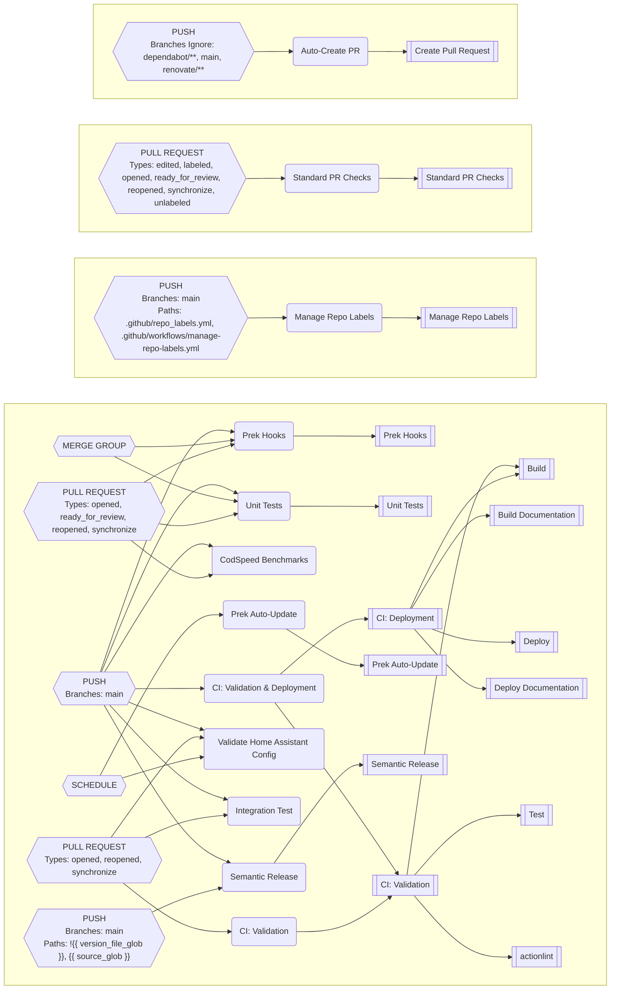

# GitHub Config Files

## Workflow Runners

Linux jobs use the CC self-hosted runner labels `self-hosted`, `linux`, `x64`,
`cc`, `iac`, and `opentofu`. All managed repositories restrict pull requests
to contributors.

## Standard PR Checks

The synced `manage-pr.yml` caller uses `__standard-pr-checks.yml` to run
PR housekeeping in one runner job without checking out the repository.
Prek stays separate so title/label changes cannot restart code validation,
and existing required prek and unit-test check names are preserved.

Repository Actions variables can disable individual operations by setting
one of these values to the literal string `true`:

| Variable | Operation |
| --- | --- |
| `CI_DISABLE_PR_LABELS` | Automatic labels |
| `CI_DISABLE_CLOSE_EMPTY_PR` | Empty-PR closing |
| `CI_DISABLE_AUTO_MERGE` | Enabling auto-merge outside `worganisation` |
| `CI_DISABLE_PREK` | Shared prek job (also applies on main/merge groups) |
| `CI_DISABLE_PR_TITLE` | Conventional title validation |

Title validation and other metadata operations are enabled by default. Set
`CI_DISABLE_PR_TITLE=true` to opt out of conventional title validation.
Auto-merge is always disabled for every `worganisation` repository, including
future repositories, regardless of inputs or variables.
The reusable workflow also accepts boolean inputs for bespoke callers.

Metadata runs on code events; edits run only when title validation is enabled.
Label events allocate a runner only for `bot:do-not-close`, and auto-merge events
no longer repeat housekeeping. A failed title check still allows labels to be
applied, blocks auto-merge, and fails the metadata job. Repositories with custom
label rules driven by label or auto-merge events need their own event policy.

The next release updates the reusable-workflow pin and syncs the metadata caller
while deleting `set-pr-auto-merge.yml` through its retained `deleteOrphaned`
mapping. Do not sync unreleased source pins: the new reusable workflow must exist
at the referenced release. Older pinned callers remain supported. Infrastructure
keeps its bespoke hooks/title checks; deployments and schedules stay independent.
When migrating bespoke callers, check branch rules before renaming required jobs.
Disabling a required job makes it skipped, so opt-outs are also policy changes.

## Repository File Mappings

### All Mappings

| Destination | [worganisation/backplane](https://github.com/worganisation/backplane) | [worganisation/esphome](https://github.com/worganisation/esphome) | [worganisation/frigate-config](https://github.com/worganisation/frigate-config) | [worganisation/gpu-worker](https://github.com/worganisation/gpu-worker) | [worganisation/home-assistant](https://github.com/worganisation/home-assistant) | [worganisation/home-assistant-appdaemon](https://github.com/worganisation/home-assistant-appdaemon) | [worganisation/home-assistant-config-validator](https://github.com/worganisation/home-assistant-config-validator) | [worganisation/infrastructure](https://github.com/worganisation/infrastructure) | [worganisation/led-matrix-controller](https://github.com/worganisation/led-matrix-controller) | [worganisation/pre-commit-hooks-dependency-sync](https://github.com/worganisation/pre-commit-hooks-dependency-sync) | [worganisation/smart-mini-crt-interface](https://github.com/worganisation/smart-mini-crt-interface) | [worganisation/very-slow-movie-player](https://github.com/worganisation/very-slow-movie-player) | [worganisation/wg-scripts](https://github.com/worganisation/wg-scripts) | [worganisation/wg-utilities](https://github.com/worganisation/wg-utilities) | [python-template](https://github.com/worgarside/python-template) |
|-------------|--------|--------|--------|--------|--------|--------|--------|--------|--------|--------|--------|--------|--------|--------|--------|
| **.github/CODEOWNERS** | [.github/CODEOWNERS](.github/CODEOWNERS) | [.github/CODEOWNERS](.github/CODEOWNERS) | | [.github/CODEOWNERS](.github/CODEOWNERS) | [.github/CODEOWNERS](.github/CODEOWNERS) | [.github/CODEOWNERS](.github/CODEOWNERS) | [.github/CODEOWNERS](.github/CODEOWNERS) | | [.github/CODEOWNERS](.github/CODEOWNERS) | [.github/CODEOWNERS](.github/CODEOWNERS) | [.github/CODEOWNERS](.github/CODEOWNERS) | [.github/CODEOWNERS](.github/CODEOWNERS) | [.github/CODEOWNERS](.github/CODEOWNERS) | [.github/CODEOWNERS](.github/CODEOWNERS) | [.github/CODEOWNERS](.github/CODEOWNERS) |
| **.github/actionlint.yaml** | [.github/actionlint.yaml](.github/actionlint.yaml) | [.github/actionlint.yaml](.github/actionlint.yaml) | | [.github/actionlint.yaml](.github/actionlint.yaml) | [.github/actionlint.yaml](.github/actionlint.yaml) | [.github/actionlint.yaml](.github/actionlint.yaml) | [.github/actionlint.yaml](.github/actionlint.yaml) | | [.github/actionlint.yaml](.github/actionlint.yaml) | [.github/actionlint.yaml](.github/actionlint.yaml) | [.github/actionlint.yaml](.github/actionlint.yaml) | [.github/actionlint.yaml](.github/actionlint.yaml) | [.github/actionlint.yaml](.github/actionlint.yaml) | [.github/actionlint.yaml](.github/actionlint.yaml) | [.github/actionlint.yaml](.github/actionlint.yaml) |
| **.github/dependabot.yml** | [.github/dependabot.yml](.github/dependabot.yml) | [.github/dependabot.yml](.github/dependabot.yml) | | [.github/dependabot.yml](.github/dependabot.yml) | [.github/dependabot.yml](.github/dependabot.yml) | [.github/dependabot.yml](.github/dependabot.yml) | [.github/dependabot.yml](.github/dependabot.yml) | | [.github/dependabot.yml](.github/dependabot.yml) | [.github/dependabot.yml](.github/dependabot.yml) | [.github/dependabot.yml](.github/dependabot.yml) | [.github/dependabot.yml](.github/dependabot.yml) | [.github/dependabot.yml](.github/dependabot.yml) | [.github/dependabot.yml](.github/dependabot.yml) | [gha_sync/configs/dependabot.yml](gha_sync/configs/dependabot.yml) |
| **.github/labeler.yml** | [.github/labeler.yml](.github/labeler.yml) | [.github/labeler.yml](.github/labeler.yml) | | [.github/labeler.yml](.github/labeler.yml) | | [.github/labeler.yml](.github/labeler.yml) | [.github/labeler.yml](.github/labeler.yml) | | [.github/labeler.yml](.github/labeler.yml) | [.github/labeler.yml](.github/labeler.yml) | [.github/labeler.yml](.github/labeler.yml) | [.github/labeler.yml](.github/labeler.yml) | [.github/labeler.yml](.github/labeler.yml) | [.github/labeler.yml](.github/labeler.yml) | [.github/labeler.yml](.github/labeler.yml) |
| **.github/release-drafter.yml** | | | | | | | | | | | [gha_sync/configs/release-drafter.yml](gha_sync/configs/release-drafter.yml) | [gha_sync/configs/release-drafter.yml](gha_sync/configs/release-drafter.yml) | | | [gha_sync/configs/release-drafter.yml](gha_sync/configs/release-drafter.yml) |
| **.github/repo_labels.yml** | [.github/repo_labels.yml](.github/repo_labels.yml) | [.github/repo_labels.yml](.github/repo_labels.yml) | | [.github/repo_labels.yml](.github/repo_labels.yml) | | [.github/repo_labels.yml](.github/repo_labels.yml) | [.github/repo_labels.yml](.github/repo_labels.yml) | | [.github/repo_labels.yml](.github/repo_labels.yml) | [.github/repo_labels.yml](.github/repo_labels.yml) | [.github/repo_labels.yml](.github/repo_labels.yml) | [.github/repo_labels.yml](.github/repo_labels.yml) | [.github/repo_labels.yml](.github/repo_labels.yml) | [.github/repo_labels.yml](.github/repo_labels.yml) | [.github/repo_labels.yml](.github/repo_labels.yml) |
| **.github/workflows/auto-create-pr.yml** | [gha_sync/workflows/all/auto-create-pr.yml](gha_sync/workflows/all/auto-create-pr.yml) | [gha_sync/workflows/all/auto-create-pr.yml](gha_sync/workflows/all/auto-create-pr.yml) | [gha_sync/workflows/all/auto-create-pr.yml](gha_sync/workflows/all/auto-create-pr.yml) | [gha_sync/workflows/all/auto-create-pr.yml](gha_sync/workflows/all/auto-create-pr.yml) | [gha_sync/workflows/all/auto-create-pr.yml](gha_sync/workflows/all/auto-create-pr.yml) | [gha_sync/workflows/all/auto-create-pr.yml](gha_sync/workflows/all/auto-create-pr.yml) | [gha_sync/workflows/all/auto-create-pr.yml](gha_sync/workflows/all/auto-create-pr.yml) | [gha_sync/workflows/all/auto-create-pr.yml](gha_sync/workflows/all/auto-create-pr.yml) | [gha_sync/workflows/all/auto-create-pr.yml](gha_sync/workflows/all/auto-create-pr.yml) | [gha_sync/workflows/all/auto-create-pr.yml](gha_sync/workflows/all/auto-create-pr.yml) | [gha_sync/workflows/all/auto-create-pr.yml](gha_sync/workflows/all/auto-create-pr.yml) | [gha_sync/workflows/all/auto-create-pr.yml](gha_sync/workflows/all/auto-create-pr.yml) | [gha_sync/workflows/all/auto-create-pr.yml](gha_sync/workflows/all/auto-create-pr.yml) | [gha_sync/workflows/all/auto-create-pr.yml](gha_sync/workflows/all/auto-create-pr.yml) | [gha_sync/workflows/all/auto-create-pr.yml](gha_sync/workflows/all/auto-create-pr.yml) |
| **.github/workflows/ci_deployment.yml** | | | | | | | | | | | [gha_sync/workflows/template/ci_deployment.template.yml](gha_sync/workflows/template/ci_deployment.template.yml) | [gha_sync/workflows/template/ci_deployment.template.yml](gha_sync/workflows/template/ci_deployment.template.yml) | | | [gha_sync/workflows/template/ci_deployment.template.yml](gha_sync/workflows/template/ci_deployment.template.yml) |
| **.github/workflows/ci_validation.yml** | | | | | | | | | | | [gha_sync/workflows/template/ci_validation.template.yml](gha_sync/workflows/template/ci_validation.template.yml) | [gha_sync/workflows/template/ci_validation.template.yml](gha_sync/workflows/template/ci_validation.template.yml) | | | [gha_sync/workflows/template/ci_validation.template.yml](gha_sync/workflows/template/ci_validation.template.yml) |
| **.github/workflows/codspeed.yml** | | | | | | | [gha_sync/workflows/template/codspeed.template.yml](gha_sync/workflows/template/codspeed.template.yml) | | [gha_sync/workflows/template/codspeed.template.yml](gha_sync/workflows/template/codspeed.template.yml) | | | | | | |
| **.github/workflows/integration-test.yml** | | | | | | | [gha_sync/workflows/repo/home-assistant-config-validator/integration-test.yml](gha_sync/workflows/repo/home-assistant-config-validator/integration-test.yml) | | | | | | | | |
| **.github/workflows/manage-pr.yml** | [gha_sync/workflows/all/manage-pr.yml](gha_sync/workflows/all/manage-pr.yml) | [gha_sync/workflows/all/manage-pr.yml](gha_sync/workflows/all/manage-pr.yml) | | [gha_sync/workflows/all/manage-pr.yml](gha_sync/workflows/all/manage-pr.yml) | [gha_sync/workflows/all/manage-pr.yml](gha_sync/workflows/all/manage-pr.yml) | [gha_sync/workflows/all/manage-pr.yml](gha_sync/workflows/all/manage-pr.yml) | [gha_sync/workflows/all/manage-pr.yml](gha_sync/workflows/all/manage-pr.yml) | | [gha_sync/workflows/all/manage-pr.yml](gha_sync/workflows/all/manage-pr.yml) | [gha_sync/workflows/all/manage-pr.yml](gha_sync/workflows/all/manage-pr.yml) | [gha_sync/workflows/all/manage-pr.yml](gha_sync/workflows/all/manage-pr.yml) | [gha_sync/workflows/all/manage-pr.yml](gha_sync/workflows/all/manage-pr.yml) | [gha_sync/workflows/all/manage-pr.yml](gha_sync/workflows/all/manage-pr.yml) | [gha_sync/workflows/all/manage-pr.yml](gha_sync/workflows/all/manage-pr.yml) | [gha_sync/workflows/all/manage-pr.yml](gha_sync/workflows/all/manage-pr.yml) |
| **.github/workflows/manage-repo-labels.yml** | [gha_sync/workflows/all/manage-repo-labels.yml](gha_sync/workflows/all/manage-repo-labels.yml) | [gha_sync/workflows/all/manage-repo-labels.yml](gha_sync/workflows/all/manage-repo-labels.yml) | | [gha_sync/workflows/all/manage-repo-labels.yml](gha_sync/workflows/all/manage-repo-labels.yml) | [gha_sync/workflows/all/manage-repo-labels.yml](gha_sync/workflows/all/manage-repo-labels.yml) | [gha_sync/workflows/all/manage-repo-labels.yml](gha_sync/workflows/all/manage-repo-labels.yml) | [gha_sync/workflows/all/manage-repo-labels.yml](gha_sync/workflows/all/manage-repo-labels.yml) | | [gha_sync/workflows/all/manage-repo-labels.yml](gha_sync/workflows/all/manage-repo-labels.yml) | [gha_sync/workflows/all/manage-repo-labels.yml](gha_sync/workflows/all/manage-repo-labels.yml) | [gha_sync/workflows/all/manage-repo-labels.yml](gha_sync/workflows/all/manage-repo-labels.yml) | [gha_sync/workflows/all/manage-repo-labels.yml](gha_sync/workflows/all/manage-repo-labels.yml) | [gha_sync/workflows/all/manage-repo-labels.yml](gha_sync/workflows/all/manage-repo-labels.yml) | [gha_sync/workflows/all/manage-repo-labels.yml](gha_sync/workflows/all/manage-repo-labels.yml) | [gha_sync/workflows/all/manage-repo-labels.yml](gha_sync/workflows/all/manage-repo-labels.yml) |
| **.github/workflows/prek-autoupdate.yml** | [gha_sync/workflows/all/prek-autoupdate.yml](gha_sync/workflows/all/prek-autoupdate.yml) | [gha_sync/workflows/all/prek-autoupdate.yml](gha_sync/workflows/all/prek-autoupdate.yml) | [gha_sync/workflows/all/prek-autoupdate.yml](gha_sync/workflows/all/prek-autoupdate.yml) | [gha_sync/workflows/all/prek-autoupdate.yml](gha_sync/workflows/all/prek-autoupdate.yml) | [gha_sync/workflows/all/prek-autoupdate.yml](gha_sync/workflows/all/prek-autoupdate.yml) | [gha_sync/workflows/all/prek-autoupdate.yml](gha_sync/workflows/all/prek-autoupdate.yml) | [gha_sync/workflows/all/prek-autoupdate.yml](gha_sync/workflows/all/prek-autoupdate.yml) | | [gha_sync/workflows/all/prek-autoupdate.yml](gha_sync/workflows/all/prek-autoupdate.yml) | [gha_sync/workflows/all/prek-autoupdate.yml](gha_sync/workflows/all/prek-autoupdate.yml) | | | [gha_sync/workflows/all/prek-autoupdate.yml](gha_sync/workflows/all/prek-autoupdate.yml) | [gha_sync/workflows/all/prek-autoupdate.yml](gha_sync/workflows/all/prek-autoupdate.yml) | |
| **.github/workflows/prek-hooks.yml** | [gha_sync/workflows/template/prek-hooks.template.yml](gha_sync/workflows/template/prek-hooks.template.yml) | [gha_sync/workflows/template/prek-hooks.template.yml](gha_sync/workflows/template/prek-hooks.template.yml) | [gha_sync/workflows/template/prek-hooks.template.yml](gha_sync/workflows/template/prek-hooks.template.yml) | [gha_sync/workflows/template/prek-hooks.template.yml](gha_sync/workflows/template/prek-hooks.template.yml) | [gha_sync/workflows/template/prek-hooks.template.yml](gha_sync/workflows/template/prek-hooks.template.yml) | [gha_sync/workflows/template/prek-hooks.template.yml](gha_sync/workflows/template/prek-hooks.template.yml) | [gha_sync/workflows/template/prek-hooks.template.yml](gha_sync/workflows/template/prek-hooks.template.yml) | | [gha_sync/workflows/template/prek-hooks.template.yml](gha_sync/workflows/template/prek-hooks.template.yml) | [gha_sync/workflows/template/prek-hooks.template.yml](gha_sync/workflows/template/prek-hooks.template.yml) | | | [gha_sync/workflows/template/prek-hooks.template.yml](gha_sync/workflows/template/prek-hooks.template.yml) | [gha_sync/workflows/template/prek-hooks.template.yml](gha_sync/workflows/template/prek-hooks.template.yml) | |
| **.github/workflows/semantic-release.yml** | | | | | [gha_sync/workflows/repo/home-assistant/semantic-release.yml](gha_sync/workflows/repo/home-assistant/semantic-release.yml) | [gha_sync/workflows/template/semantic-release.template.yml](gha_sync/workflows/template/semantic-release.template.yml) | [gha_sync/workflows/template/semantic-release.template.yml](gha_sync/workflows/template/semantic-release.template.yml) | | [gha_sync/workflows/template/semantic-release.template.yml](gha_sync/workflows/template/semantic-release.template.yml) | [gha_sync/workflows/template/semantic-release.template.yml](gha_sync/workflows/template/semantic-release.template.yml) | | | [gha_sync/workflows/template/semantic-release.template.yml](gha_sync/workflows/template/semantic-release.template.yml) | | |
| **.github/workflows/unit-tests.yml** | [gha_sync/workflows/template/unit-tests.template.yml](gha_sync/workflows/template/unit-tests.template.yml) | | | | | | [gha_sync/workflows/template/unit-tests.template.yml](gha_sync/workflows/template/unit-tests.template.yml) | | [gha_sync/workflows/template/unit-tests.template.yml](gha_sync/workflows/template/unit-tests.template.yml) | | | | | [gha_sync/workflows/template/unit-tests.template.yml](gha_sync/workflows/template/unit-tests.template.yml) | |
| **.github/workflows/validate-home-assistant-config.yml** | | | | | [gha_sync/workflows/repo/home-assistant/validate-home-assistant-config.yml](gha_sync/workflows/repo/home-assistant/validate-home-assistant-config.yml) | | | | | | | | | | |
| **.yamllint** | [.yamllint](.yamllint) | [.yamllint](.yamllint) | | [.yamllint](.yamllint) | | [.yamllint](.yamllint) | [.yamllint](.yamllint) | | [.yamllint](.yamllint) | [.yamllint](.yamllint) | [.yamllint](.yamllint) | [.yamllint](.yamllint) | [.yamllint](.yamllint) | | [.yamllint](.yamllint) |
### Per-Repository Mappings

### [worganisation/backplane](https://github.com/worganisation/backplane) (12 files)

Mapping Table

| Source | Destination |
|--------|-------------|
| [.github/CODEOWNERS](.github/CODEOWNERS) | [.github/CODEOWNERS](https://github.com/worganisation/backplane/.github/CODEOWNERS) |
| [.github/actionlint.yaml](.github/actionlint.yaml) | [.github/actionlint.yaml](https://github.com/worganisation/backplane/.github/actionlint.yaml) |
| [.github/dependabot.yml](.github/dependabot.yml) | [.github/dependabot.yml](https://github.com/worganisation/backplane/.github/dependabot.yml) |
| [.github/labeler.yml](.github/labeler.yml) | [.github/labeler.yml](https://github.com/worganisation/backplane/.github/labeler.yml) |
| [.github/repo_labels.yml](.github/repo_labels.yml) | [.github/repo_labels.yml](https://github.com/worganisation/backplane/.github/repo_labels.yml) |
| [.yamllint](.yamllint) | [.yamllint](https://github.com/worganisation/backplane/.yamllint) |
| [gha_sync/workflows/all/auto-create-pr.yml](gha_sync/workflows/all/auto-create-pr.yml) | [.github/workflows/auto-create-pr.yml](https://github.com/worganisation/backplane/.github/workflows/auto-create-pr.yml) |
| [gha_sync/workflows/all/manage-pr.yml](gha_sync/workflows/all/manage-pr.yml) | [.github/workflows/manage-pr.yml](https://github.com/worganisation/backplane/.github/workflows/manage-pr.yml) |
| [gha_sync/workflows/all/manage-repo-labels.yml](gha_sync/workflows/all/manage-repo-labels.yml) | [.github/workflows/manage-repo-labels.yml](https://github.com/worganisation/backplane/.github/workflows/manage-repo-labels.yml) |
| [gha_sync/workflows/all/prek-autoupdate.yml](gha_sync/workflows/all/prek-autoupdate.yml) | [.github/workflows/prek-autoupdate.yml](https://github.com/worganisation/backplane/.github/workflows/prek-autoupdate.yml) |
| [gha_sync/workflows/template/prek-hooks.template.yml](gha_sync/workflows/template/prek-hooks.template.yml) | [.github/workflows/prek-hooks.yml](https://github.com/worganisation/backplane/.github/workflows/prek-hooks.yml) |
| [gha_sync/workflows/template/unit-tests.template.yml](gha_sync/workflows/template/unit-tests.template.yml) | [.github/workflows/unit-tests.yml](https://github.com/worganisation/backplane/.github/workflows/unit-tests.yml) |

### [worganisation/esphome](https://github.com/worganisation/esphome) (11 files)

Mapping Table

| Source | Destination |
|--------|-------------|
| [.github/CODEOWNERS](.github/CODEOWNERS) | [.github/CODEOWNERS](https://github.com/worganisation/esphome/.github/CODEOWNERS) |
| [.github/actionlint.yaml](.github/actionlint.yaml) | [.github/actionlint.yaml](https://github.com/worganisation/esphome/.github/actionlint.yaml) |
| [.github/dependabot.yml](.github/dependabot.yml) | [.github/dependabot.yml](https://github.com/worganisation/esphome/.github/dependabot.yml) |
| [.github/labeler.yml](.github/labeler.yml) | [.github/labeler.yml](https://github.com/worganisation/esphome/.github/labeler.yml) |
| [.github/repo_labels.yml](.github/repo_labels.yml) | [.github/repo_labels.yml](https://github.com/worganisation/esphome/.github/repo_labels.yml) |
| [.yamllint](.yamllint) | [.yamllint](https://github.com/worganisation/esphome/.yamllint) |
| [gha_sync/workflows/all/auto-create-pr.yml](gha_sync/workflows/all/auto-create-pr.yml) | [.github/workflows/auto-create-pr.yml](https://github.com/worganisation/esphome/.github/workflows/auto-create-pr.yml) |
| [gha_sync/workflows/all/manage-pr.yml](gha_sync/workflows/all/manage-pr.yml) | [.github/workflows/manage-pr.yml](https://github.com/worganisation/esphome/.github/workflows/manage-pr.yml) |
| [gha_sync/workflows/all/manage-repo-labels.yml](gha_sync/workflows/all/manage-repo-labels.yml) | [.github/workflows/manage-repo-labels.yml](https://github.com/worganisation/esphome/.github/workflows/manage-repo-labels.yml) |
| [gha_sync/workflows/all/prek-autoupdate.yml](gha_sync/workflows/all/prek-autoupdate.yml) | [.github/workflows/prek-autoupdate.yml](https://github.com/worganisation/esphome/.github/workflows/prek-autoupdate.yml) |
| [gha_sync/workflows/template/prek-hooks.template.yml](gha_sync/workflows/template/prek-hooks.template.yml) | [.github/workflows/prek-hooks.yml](https://github.com/worganisation/esphome/.github/workflows/prek-hooks.yml) |

### [worganisation/frigate-config](https://github.com/worganisation/frigate-config) (3 files)

Mapping Table

| Source | Destination |
|--------|-------------|
| [gha_sync/workflows/all/auto-create-pr.yml](gha_sync/workflows/all/auto-create-pr.yml) | [.github/workflows/auto-create-pr.yml](https://github.com/worganisation/frigate-config/.github/workflows/auto-create-pr.yml) |
| [gha_sync/workflows/all/prek-autoupdate.yml](gha_sync/workflows/all/prek-autoupdate.yml) | [.github/workflows/prek-autoupdate.yml](https://github.com/worganisation/frigate-config/.github/workflows/prek-autoupdate.yml) |
| [gha_sync/workflows/template/prek-hooks.template.yml](gha_sync/workflows/template/prek-hooks.template.yml) | [.github/workflows/prek-hooks.yml](https://github.com/worganisation/frigate-config/.github/workflows/prek-hooks.yml) |

### [worganisation/gpu-worker](https://github.com/worganisation/gpu-worker) (11 files)

Mapping Table

| Source | Destination |
|--------|-------------|
| [.github/CODEOWNERS](.github/CODEOWNERS) | [.github/CODEOWNERS](https://github.com/worganisation/gpu-worker/.github/CODEOWNERS) |
| [.github/actionlint.yaml](.github/actionlint.yaml) | [.github/actionlint.yaml](https://github.com/worganisation/gpu-worker/.github/actionlint.yaml) |
| [.github/dependabot.yml](.github/dependabot.yml) | [.github/dependabot.yml](https://github.com/worganisation/gpu-worker/.github/dependabot.yml) |
| [.github/labeler.yml](.github/labeler.yml) | [.github/labeler.yml](https://github.com/worganisation/gpu-worker/.github/labeler.yml) |
| [.github/repo_labels.yml](.github/repo_labels.yml) | [.github/repo_labels.yml](https://github.com/worganisation/gpu-worker/.github/repo_labels.yml) |
| [.yamllint](.yamllint) | [.yamllint](https://github.com/worganisation/gpu-worker/.yamllint) |
| [gha_sync/workflows/all/auto-create-pr.yml](gha_sync/workflows/all/auto-create-pr.yml) | [.github/workflows/auto-create-pr.yml](https://github.com/worganisation/gpu-worker/.github/workflows/auto-create-pr.yml) |
| [gha_sync/workflows/all/manage-pr.yml](gha_sync/workflows/all/manage-pr.yml) | [.github/workflows/manage-pr.yml](https://github.com/worganisation/gpu-worker/.github/workflows/manage-pr.yml) |
| [gha_sync/workflows/all/manage-repo-labels.yml](gha_sync/workflows/all/manage-repo-labels.yml) | [.github/workflows/manage-repo-labels.yml](https://github.com/worganisation/gpu-worker/.github/workflows/manage-repo-labels.yml) |
| [gha_sync/workflows/all/prek-autoupdate.yml](gha_sync/workflows/all/prek-autoupdate.yml) | [.github/workflows/prek-autoupdate.yml](https://github.com/worganisation/gpu-worker/.github/workflows/prek-autoupdate.yml) |
| [gha_sync/workflows/template/prek-hooks.template.yml](gha_sync/workflows/template/prek-hooks.template.yml) | [.github/workflows/prek-hooks.yml](https://github.com/worganisation/gpu-worker/.github/workflows/prek-hooks.yml) |

### [worganisation/home-assistant](https://github.com/worganisation/home-assistant) (10 files)

Mapping Table

| Source | Destination |
|--------|-------------|
| [.github/CODEOWNERS](.github/CODEOWNERS) | [.github/CODEOWNERS](https://github.com/worganisation/home-assistant/.github/CODEOWNERS) |
| [.github/actionlint.yaml](.github/actionlint.yaml) | [.github/actionlint.yaml](https://github.com/worganisation/home-assistant/.github/actionlint.yaml) |
| [.github/dependabot.yml](.github/dependabot.yml) | [.github/dependabot.yml](https://github.com/worganisation/home-assistant/.github/dependabot.yml) |
| [gha_sync/workflows/all/auto-create-pr.yml](gha_sync/workflows/all/auto-create-pr.yml) | [.github/workflows/auto-create-pr.yml](https://github.com/worganisation/home-assistant/.github/workflows/auto-create-pr.yml) |
| [gha_sync/workflows/all/manage-pr.yml](gha_sync/workflows/all/manage-pr.yml) | [.github/workflows/manage-pr.yml](https://github.com/worganisation/home-assistant/.github/workflows/manage-pr.yml) |
| [gha_sync/workflows/all/manage-repo-labels.yml](gha_sync/workflows/all/manage-repo-labels.yml) | [.github/workflows/manage-repo-labels.yml](https://github.com/worganisation/home-assistant/.github/workflows/manage-repo-labels.yml) |
| [gha_sync/workflows/all/prek-autoupdate.yml](gha_sync/workflows/all/prek-autoupdate.yml) | [.github/workflows/prek-autoupdate.yml](https://github.com/worganisation/home-assistant/.github/workflows/prek-autoupdate.yml) |
| [gha_sync/workflows/repo/home-assistant/semantic-release.yml](gha_sync/workflows/repo/home-assistant/semantic-release.yml) | [.github/workflows/semantic-release.yml](https://github.com/worganisation/home-assistant/.github/workflows/semantic-release.yml) |
| [gha_sync/workflows/repo/home-assistant/validate-home-assistant-config.yml](gha_sync/workflows/repo/home-assistant/validate-home-assistant-config.yml) | [.github/workflows/validate-home-assistant-config.yml](https://github.com/worganisation/home-assistant/.github/workflows/validate-home-assistant-config.yml) |
| [gha_sync/workflows/template/prek-hooks.template.yml](gha_sync/workflows/template/prek-hooks.template.yml) | [.github/workflows/prek-hooks.yml](https://github.com/worganisation/home-assistant/.github/workflows/prek-hooks.yml) |

### [worganisation/home-assistant-appdaemon](https://github.com/worganisation/home-assistant-appdaemon) (12 files)

Mapping Table

| Source | Destination |
|--------|-------------|
| [.github/CODEOWNERS](.github/CODEOWNERS) | [.github/CODEOWNERS](https://github.com/worganisation/home-assistant-appdaemon/.github/CODEOWNERS) |
| [.github/actionlint.yaml](.github/actionlint.yaml) | [.github/actionlint.yaml](https://github.com/worganisation/home-assistant-appdaemon/.github/actionlint.yaml) |
| [.github/dependabot.yml](.github/dependabot.yml) | [.github/dependabot.yml](https://github.com/worganisation/home-assistant-appdaemon/.github/dependabot.yml) |
| [.github/labeler.yml](.github/labeler.yml) | [.github/labeler.yml](https://github.com/worganisation/home-assistant-appdaemon/.github/labeler.yml) |
| [.github/repo_labels.yml](.github/repo_labels.yml) | [.github/repo_labels.yml](https://github.com/worganisation/home-assistant-appdaemon/.github/repo_labels.yml) |
| [.yamllint](.yamllint) | [.yamllint](https://github.com/worganisation/home-assistant-appdaemon/.yamllint) |
| [gha_sync/workflows/all/auto-create-pr.yml](gha_sync/workflows/all/auto-create-pr.yml) | [.github/workflows/auto-create-pr.yml](https://github.com/worganisation/home-assistant-appdaemon/.github/workflows/auto-create-pr.yml) |
| [gha_sync/workflows/all/manage-pr.yml](gha_sync/workflows/all/manage-pr.yml) | [.github/workflows/manage-pr.yml](https://github.com/worganisation/home-assistant-appdaemon/.github/workflows/manage-pr.yml) |
| [gha_sync/workflows/all/manage-repo-labels.yml](gha_sync/workflows/all/manage-repo-labels.yml) | [.github/workflows/manage-repo-labels.yml](https://github.com/worganisation/home-assistant-appdaemon/.github/workflows/manage-repo-labels.yml) |
| [gha_sync/workflows/all/prek-autoupdate.yml](gha_sync/workflows/all/prek-autoupdate.yml) | [.github/workflows/prek-autoupdate.yml](https://github.com/worganisation/home-assistant-appdaemon/.github/workflows/prek-autoupdate.yml) |
| [gha_sync/workflows/template/prek-hooks.template.yml](gha_sync/workflows/template/prek-hooks.template.yml) | [.github/workflows/prek-hooks.yml](https://github.com/worganisation/home-assistant-appdaemon/.github/workflows/prek-hooks.yml) |
| [gha_sync/workflows/template/semantic-release.template.yml](gha_sync/workflows/template/semantic-release.template.yml) | [.github/workflows/semantic-release.yml](https://github.com/worganisation/home-assistant-appdaemon/.github/workflows/semantic-release.yml) |

### [worganisation/home-assistant-config-validator](https://github.com/worganisation/home-assistant-config-validator) (15 files)

Mapping Table

| Source | Destination |
|--------|-------------|
| [.github/CODEOWNERS](.github/CODEOWNERS) | [.github/CODEOWNERS](https://github.com/worganisation/home-assistant-config-validator/.github/CODEOWNERS) |
| [.github/actionlint.yaml](.github/actionlint.yaml) | [.github/actionlint.yaml](https://github.com/worganisation/home-assistant-config-validator/.github/actionlint.yaml) |
| [.github/dependabot.yml](.github/dependabot.yml) | [.github/dependabot.yml](https://github.com/worganisation/home-assistant-config-validator/.github/dependabot.yml) |
| [.github/labeler.yml](.github/labeler.yml) | [.github/labeler.yml](https://github.com/worganisation/home-assistant-config-validator/.github/labeler.yml) |
| [.github/repo_labels.yml](.github/repo_labels.yml) | [.github/repo_labels.yml](https://github.com/worganisation/home-assistant-config-validator/.github/repo_labels.yml) |
| [.yamllint](.yamllint) | [.yamllint](https://github.com/worganisation/home-assistant-config-validator/.yamllint) |
| [gha_sync/workflows/all/auto-create-pr.yml](gha_sync/workflows/all/auto-create-pr.yml) | [.github/workflows/auto-create-pr.yml](https://github.com/worganisation/home-assistant-config-validator/.github/workflows/auto-create-pr.yml) |
| [gha_sync/workflows/all/manage-pr.yml](gha_sync/workflows/all/manage-pr.yml) | [.github/workflows/manage-pr.yml](https://github.com/worganisation/home-assistant-config-validator/.github/workflows/manage-pr.yml) |
| [gha_sync/workflows/all/manage-repo-labels.yml](gha_sync/workflows/all/manage-repo-labels.yml) | [.github/workflows/manage-repo-labels.yml](https://github.com/worganisation/home-assistant-config-validator/.github/workflows/manage-repo-labels.yml) |
| [gha_sync/workflows/all/prek-autoupdate.yml](gha_sync/workflows/all/prek-autoupdate.yml) | [.github/workflows/prek-autoupdate.yml](https://github.com/worganisation/home-assistant-config-validator/.github/workflows/prek-autoupdate.yml) |
| [gha_sync/workflows/repo/home-assistant-config-validator/integration-test.yml](gha_sync/workflows/repo/home-assistant-config-validator/integration-test.yml) | [.github/workflows/integration-test.yml](https://github.com/worganisation/home-assistant-config-validator/.github/workflows/integration-test.yml) |
| [gha_sync/workflows/template/codspeed.template.yml](gha_sync/workflows/template/codspeed.template.yml) | [.github/workflows/codspeed.yml](https://github.com/worganisation/home-assistant-config-validator/.github/workflows/codspeed.yml) |
| [gha_sync/workflows/template/prek-hooks.template.yml](gha_sync/workflows/template/prek-hooks.template.yml) | [.github/workflows/prek-hooks.yml](https://github.com/worganisation/home-assistant-config-validator/.github/workflows/prek-hooks.yml) |
| [gha_sync/workflows/template/semantic-release.template.yml](gha_sync/workflows/template/semantic-release.template.yml) | [.github/workflows/semantic-release.yml](https://github.com/worganisation/home-assistant-config-validator/.github/workflows/semantic-release.yml) |
| [gha_sync/workflows/template/unit-tests.template.yml](gha_sync/workflows/template/unit-tests.template.yml) | [.github/workflows/unit-tests.yml](https://github.com/worganisation/home-assistant-config-validator/.github/workflows/unit-tests.yml) |

### [worganisation/infrastructure](https://github.com/worganisation/infrastructure) (1 files)

Mapping Table

| Source | Destination |
|--------|-------------|
| [gha_sync/workflows/all/auto-create-pr.yml](gha_sync/workflows/all/auto-create-pr.yml) | [.github/workflows/auto-create-pr.yml](https://github.com/worganisation/infrastructure/.github/workflows/auto-create-pr.yml) |

### [worganisation/led-matrix-controller](https://github.com/worganisation/led-matrix-controller) (14 files)

Mapping Table

| Source | Destination |
|--------|-------------|
| [.github/CODEOWNERS](.github/CODEOWNERS) | [.github/CODEOWNERS](https://github.com/worganisation/led-matrix-controller/.github/CODEOWNERS) |
| [.github/actionlint.yaml](.github/actionlint.yaml) | [.github/actionlint.yaml](https://github.com/worganisation/led-matrix-controller/.github/actionlint.yaml) |
| [.github/dependabot.yml](.github/dependabot.yml) | [.github/dependabot.yml](https://github.com/worganisation/led-matrix-controller/.github/dependabot.yml) |
| [.github/labeler.yml](.github/labeler.yml) | [.github/labeler.yml](https://github.com/worganisation/led-matrix-controller/.github/labeler.yml) |
| [.github/repo_labels.yml](.github/repo_labels.yml) | [.github/repo_labels.yml](https://github.com/worganisation/led-matrix-controller/.github/repo_labels.yml) |
| [.yamllint](.yamllint) | [.yamllint](https://github.com/worganisation/led-matrix-controller/.yamllint) |
| [gha_sync/workflows/all/auto-create-pr.yml](gha_sync/workflows/all/auto-create-pr.yml) | [.github/workflows/auto-create-pr.yml](https://github.com/worganisation/led-matrix-controller/.github/workflows/auto-create-pr.yml) |
| [gha_sync/workflows/all/manage-pr.yml](gha_sync/workflows/all/manage-pr.yml) | [.github/workflows/manage-pr.yml](https://github.com/worganisation/led-matrix-controller/.github/workflows/manage-pr.yml) |
| [gha_sync/workflows/all/manage-repo-labels.yml](gha_sync/workflows/all/manage-repo-labels.yml) | [.github/workflows/manage-repo-labels.yml](https://github.com/worganisation/led-matrix-controller/.github/workflows/manage-repo-labels.yml) |
| [gha_sync/workflows/all/prek-autoupdate.yml](gha_sync/workflows/all/prek-autoupdate.yml) | [.github/workflows/prek-autoupdate.yml](https://github.com/worganisation/led-matrix-controller/.github/workflows/prek-autoupdate.yml) |
| [gha_sync/workflows/template/codspeed.template.yml](gha_sync/workflows/template/codspeed.template.yml) | [.github/workflows/codspeed.yml](https://github.com/worganisation/led-matrix-controller/.github/workflows/codspeed.yml) |
| [gha_sync/workflows/template/prek-hooks.template.yml](gha_sync/workflows/template/prek-hooks.template.yml) | [.github/workflows/prek-hooks.yml](https://github.com/worganisation/led-matrix-controller/.github/workflows/prek-hooks.yml) |
| [gha_sync/workflows/template/semantic-release.template.yml](gha_sync/workflows/template/semantic-release.template.yml) | [.github/workflows/semantic-release.yml](https://github.com/worganisation/led-matrix-controller/.github/workflows/semantic-release.yml) |
| [gha_sync/workflows/template/unit-tests.template.yml](gha_sync/workflows/template/unit-tests.template.yml) | [.github/workflows/unit-tests.yml](https://github.com/worganisation/led-matrix-controller/.github/workflows/unit-tests.yml) |

### [worganisation/pre-commit-hooks-dependency-sync](https://github.com/worganisation/pre-commit-hooks-dependency-sync) (12 files)

Mapping Table

| Source | Destination |
|--------|-------------|
| [.github/CODEOWNERS](.github/CODEOWNERS) | [.github/CODEOWNERS](https://github.com/worganisation/pre-commit-hooks-dependency-sync/.github/CODEOWNERS) |
| [.github/actionlint.yaml](.github/actionlint.yaml) | [.github/actionlint.yaml](https://github.com/worganisation/pre-commit-hooks-dependency-sync/.github/actionlint.yaml) |
| [.github/dependabot.yml](.github/dependabot.yml) | [.github/dependabot.yml](https://github.com/worganisation/pre-commit-hooks-dependency-sync/.github/dependabot.yml) |
| [.github/labeler.yml](.github/labeler.yml) | [.github/labeler.yml](https://github.com/worganisation/pre-commit-hooks-dependency-sync/.github/labeler.yml) |
| [.github/repo_labels.yml](.github/repo_labels.yml) | [.github/repo_labels.yml](https://github.com/worganisation/pre-commit-hooks-dependency-sync/.github/repo_labels.yml) |
| [.yamllint](.yamllint) | [.yamllint](https://github.com/worganisation/pre-commit-hooks-dependency-sync/.yamllint) |
| [gha_sync/workflows/all/auto-create-pr.yml](gha_sync/workflows/all/auto-create-pr.yml) | [.github/workflows/auto-create-pr.yml](https://github.com/worganisation/pre-commit-hooks-dependency-sync/.github/workflows/auto-create-pr.yml) |
| [gha_sync/workflows/all/manage-pr.yml](gha_sync/workflows/all/manage-pr.yml) | [.github/workflows/manage-pr.yml](https://github.com/worganisation/pre-commit-hooks-dependency-sync/.github/workflows/manage-pr.yml) |
| [gha_sync/workflows/all/manage-repo-labels.yml](gha_sync/workflows/all/manage-repo-labels.yml) | [.github/workflows/manage-repo-labels.yml](https://github.com/worganisation/pre-commit-hooks-dependency-sync/.github/workflows/manage-repo-labels.yml) |
| [gha_sync/workflows/all/prek-autoupdate.yml](gha_sync/workflows/all/prek-autoupdate.yml) | [.github/workflows/prek-autoupdate.yml](https://github.com/worganisation/pre-commit-hooks-dependency-sync/.github/workflows/prek-autoupdate.yml) |
| [gha_sync/workflows/template/prek-hooks.template.yml](gha_sync/workflows/template/prek-hooks.template.yml) | [.github/workflows/prek-hooks.yml](https://github.com/worganisation/pre-commit-hooks-dependency-sync/.github/workflows/prek-hooks.yml) |
| [gha_sync/workflows/template/semantic-release.template.yml](gha_sync/workflows/template/semantic-release.template.yml) | [.github/workflows/semantic-release.yml](https://github.com/worganisation/pre-commit-hooks-dependency-sync/.github/workflows/semantic-release.yml) |

### [worganisation/smart-mini-crt-interface](https://github.com/worganisation/smart-mini-crt-interface) (12 files)

Mapping Table

| Source | Destination |
|--------|-------------|
| [.github/CODEOWNERS](.github/CODEOWNERS) | [.github/CODEOWNERS](https://github.com/worganisation/smart-mini-crt-interface/.github/CODEOWNERS) |
| [.github/actionlint.yaml](.github/actionlint.yaml) | [.github/actionlint.yaml](https://github.com/worganisation/smart-mini-crt-interface/.github/actionlint.yaml) |
| [.github/dependabot.yml](.github/dependabot.yml) | [.github/dependabot.yml](https://github.com/worganisation/smart-mini-crt-interface/.github/dependabot.yml) |
| [.github/labeler.yml](.github/labeler.yml) | [.github/labeler.yml](https://github.com/worganisation/smart-mini-crt-interface/.github/labeler.yml) |
| [.github/repo_labels.yml](.github/repo_labels.yml) | [.github/repo_labels.yml](https://github.com/worganisation/smart-mini-crt-interface/.github/repo_labels.yml) |
| [.yamllint](.yamllint) | [.yamllint](https://github.com/worganisation/smart-mini-crt-interface/.yamllint) |
| [gha_sync/configs/release-drafter.yml](gha_sync/configs/release-drafter.yml) | [.github/release-drafter.yml](https://github.com/worganisation/smart-mini-crt-interface/.github/release-drafter.yml) |
| [gha_sync/workflows/all/auto-create-pr.yml](gha_sync/workflows/all/auto-create-pr.yml) | [.github/workflows/auto-create-pr.yml](https://github.com/worganisation/smart-mini-crt-interface/.github/workflows/auto-create-pr.yml) |
| [gha_sync/workflows/all/manage-pr.yml](gha_sync/workflows/all/manage-pr.yml) | [.github/workflows/manage-pr.yml](https://github.com/worganisation/smart-mini-crt-interface/.github/workflows/manage-pr.yml) |
| [gha_sync/workflows/all/manage-repo-labels.yml](gha_sync/workflows/all/manage-repo-labels.yml) | [.github/workflows/manage-repo-labels.yml](https://github.com/worganisation/smart-mini-crt-interface/.github/workflows/manage-repo-labels.yml) |
| [gha_sync/workflows/template/ci_deployment.template.yml](gha_sync/workflows/template/ci_deployment.template.yml) | [.github/workflows/ci_deployment.yml](https://github.com/worganisation/smart-mini-crt-interface/.github/workflows/ci_deployment.yml) |
| [gha_sync/workflows/template/ci_validation.template.yml](gha_sync/workflows/template/ci_validation.template.yml) | [.github/workflows/ci_validation.yml](https://github.com/worganisation/smart-mini-crt-interface/.github/workflows/ci_validation.yml) |

### [worganisation/very-slow-movie-player](https://github.com/worganisation/very-slow-movie-player) (12 files)

Mapping Table

| Source | Destination |
|--------|-------------|
| [.github/CODEOWNERS](.github/CODEOWNERS) | [.github/CODEOWNERS](https://github.com/worganisation/very-slow-movie-player/.github/CODEOWNERS) |
| [.github/actionlint.yaml](.github/actionlint.yaml) | [.github/actionlint.yaml](https://github.com/worganisation/very-slow-movie-player/.github/actionlint.yaml) |
| [.github/dependabot.yml](.github/dependabot.yml) | [.github/dependabot.yml](https://github.com/worganisation/very-slow-movie-player/.github/dependabot.yml) |
| [.github/labeler.yml](.github/labeler.yml) | [.github/labeler.yml](https://github.com/worganisation/very-slow-movie-player/.github/labeler.yml) |
| [.github/repo_labels.yml](.github/repo_labels.yml) | [.github/repo_labels.yml](https://github.com/worganisation/very-slow-movie-player/.github/repo_labels.yml) |
| [.yamllint](.yamllint) | [.yamllint](https://github.com/worganisation/very-slow-movie-player/.yamllint) |
| [gha_sync/configs/release-drafter.yml](gha_sync/configs/release-drafter.yml) | [.github/release-drafter.yml](https://github.com/worganisation/very-slow-movie-player/.github/release-drafter.yml) |
| [gha_sync/workflows/all/auto-create-pr.yml](gha_sync/workflows/all/auto-create-pr.yml) | [.github/workflows/auto-create-pr.yml](https://github.com/worganisation/very-slow-movie-player/.github/workflows/auto-create-pr.yml) |
| [gha_sync/workflows/all/manage-pr.yml](gha_sync/workflows/all/manage-pr.yml) | [.github/workflows/manage-pr.yml](https://github.com/worganisation/very-slow-movie-player/.github/workflows/manage-pr.yml) |
| [gha_sync/workflows/all/manage-repo-labels.yml](gha_sync/workflows/all/manage-repo-labels.yml) | [.github/workflows/manage-repo-labels.yml](https://github.com/worganisation/very-slow-movie-player/.github/workflows/manage-repo-labels.yml) |
| [gha_sync/workflows/template/ci_deployment.template.yml](gha_sync/workflows/template/ci_deployment.template.yml) | [.github/workflows/ci_deployment.yml](https://github.com/worganisation/very-slow-movie-player/.github/workflows/ci_deployment.yml) |
| [gha_sync/workflows/template/ci_validation.template.yml](gha_sync/workflows/template/ci_validation.template.yml) | [.github/workflows/ci_validation.yml](https://github.com/worganisation/very-slow-movie-player/.github/workflows/ci_validation.yml) |

### [worganisation/wg-scripts](https://github.com/worganisation/wg-scripts) (12 files)

Mapping Table

| Source | Destination |
|--------|-------------|
| [.github/CODEOWNERS](.github/CODEOWNERS) | [.github/CODEOWNERS](https://github.com/worganisation/wg-scripts/.github/CODEOWNERS) |
| [.github/actionlint.yaml](.github/actionlint.yaml) | [.github/actionlint.yaml](https://github.com/worganisation/wg-scripts/.github/actionlint.yaml) |
| [.github/dependabot.yml](.github/dependabot.yml) | [.github/dependabot.yml](https://github.com/worganisation/wg-scripts/.github/dependabot.yml) |
| [.github/labeler.yml](.github/labeler.yml) | [.github/labeler.yml](https://github.com/worganisation/wg-scripts/.github/labeler.yml) |
| [.github/repo_labels.yml](.github/repo_labels.yml) | [.github/repo_labels.yml](https://github.com/worganisation/wg-scripts/.github/repo_labels.yml) |
| [.yamllint](.yamllint) | [.yamllint](https://github.com/worganisation/wg-scripts/.yamllint) |
| [gha_sync/workflows/all/auto-create-pr.yml](gha_sync/workflows/all/auto-create-pr.yml) | [.github/workflows/auto-create-pr.yml](https://github.com/worganisation/wg-scripts/.github/workflows/auto-create-pr.yml) |
| [gha_sync/workflows/all/manage-pr.yml](gha_sync/workflows/all/manage-pr.yml) | [.github/workflows/manage-pr.yml](https://github.com/worganisation/wg-scripts/.github/workflows/manage-pr.yml) |
| [gha_sync/workflows/all/manage-repo-labels.yml](gha_sync/workflows/all/manage-repo-labels.yml) | [.github/workflows/manage-repo-labels.yml](https://github.com/worganisation/wg-scripts/.github/workflows/manage-repo-labels.yml) |
| [gha_sync/workflows/all/prek-autoupdate.yml](gha_sync/workflows/all/prek-autoupdate.yml) | [.github/workflows/prek-autoupdate.yml](https://github.com/worganisation/wg-scripts/.github/workflows/prek-autoupdate.yml) |
| [gha_sync/workflows/template/prek-hooks.template.yml](gha_sync/workflows/template/prek-hooks.template.yml) | [.github/workflows/prek-hooks.yml](https://github.com/worganisation/wg-scripts/.github/workflows/prek-hooks.yml) |
| [gha_sync/workflows/template/semantic-release.template.yml](gha_sync/workflows/template/semantic-release.template.yml) | [.github/workflows/semantic-release.yml](https://github.com/worganisation/wg-scripts/.github/workflows/semantic-release.yml) |

### [worganisation/wg-utilities](https://github.com/worganisation/wg-utilities) (11 files)

Mapping Table

| Source | Destination |
|--------|-------------|
| [.github/CODEOWNERS](.github/CODEOWNERS) | [.github/CODEOWNERS](https://github.com/worganisation/wg-utilities/.github/CODEOWNERS) |
| [.github/actionlint.yaml](.github/actionlint.yaml) | [.github/actionlint.yaml](https://github.com/worganisation/wg-utilities/.github/actionlint.yaml) |
| [.github/dependabot.yml](.github/dependabot.yml) | [.github/dependabot.yml](https://github.com/worganisation/wg-utilities/.github/dependabot.yml) |
| [.github/labeler.yml](.github/labeler.yml) | [.github/labeler.yml](https://github.com/worganisation/wg-utilities/.github/labeler.yml) |
| [.github/repo_labels.yml](.github/repo_labels.yml) | [.github/repo_labels.yml](https://github.com/worganisation/wg-utilities/.github/repo_labels.yml) |
| [gha_sync/workflows/all/auto-create-pr.yml](gha_sync/workflows/all/auto-create-pr.yml) | [.github/workflows/auto-create-pr.yml](https://github.com/worganisation/wg-utilities/.github/workflows/auto-create-pr.yml) |
| [gha_sync/workflows/all/manage-pr.yml](gha_sync/workflows/all/manage-pr.yml) | [.github/workflows/manage-pr.yml](https://github.com/worganisation/wg-utilities/.github/workflows/manage-pr.yml) |
| [gha_sync/workflows/all/manage-repo-labels.yml](gha_sync/workflows/all/manage-repo-labels.yml) | [.github/workflows/manage-repo-labels.yml](https://github.com/worganisation/wg-utilities/.github/workflows/manage-repo-labels.yml) |
| [gha_sync/workflows/all/prek-autoupdate.yml](gha_sync/workflows/all/prek-autoupdate.yml) | [.github/workflows/prek-autoupdate.yml](https://github.com/worganisation/wg-utilities/.github/workflows/prek-autoupdate.yml) |
| [gha_sync/workflows/template/prek-hooks.template.yml](gha_sync/workflows/template/prek-hooks.template.yml) | [.github/workflows/prek-hooks.yml](https://github.com/worganisation/wg-utilities/.github/workflows/prek-hooks.yml) |
| [gha_sync/workflows/template/unit-tests.template.yml](gha_sync/workflows/template/unit-tests.template.yml) | [.github/workflows/unit-tests.yml](https://github.com/worganisation/wg-utilities/.github/workflows/unit-tests.yml) |

### [python-template](https://github.com/worgarside/python-template) (12 files)

Mapping Table

| Source | Destination |
|--------|-------------|
| [.github/CODEOWNERS](.github/CODEOWNERS) | [.github/CODEOWNERS](https://github.com/worgarside/python-template/.github/CODEOWNERS) |
| [.github/actionlint.yaml](.github/actionlint.yaml) | [.github/actionlint.yaml](https://github.com/worgarside/python-template/.github/actionlint.yaml) |
| [.github/labeler.yml](.github/labeler.yml) | [.github/labeler.yml](https://github.com/worgarside/python-template/.github/labeler.yml) |
| [.github/repo_labels.yml](.github/repo_labels.yml) | [.github/repo_labels.yml](https://github.com/worgarside/python-template/.github/repo_labels.yml) |
| [.yamllint](.yamllint) | [.yamllint](https://github.com/worgarside/python-template/.yamllint) |
| [gha_sync/configs/dependabot.yml](gha_sync/configs/dependabot.yml) | [.github/dependabot.yml](https://github.com/worgarside/python-template/.github/dependabot.yml) |
| [gha_sync/configs/release-drafter.yml](gha_sync/configs/release-drafter.yml) | [.github/release-drafter.yml](https://github.com/worgarside/python-template/.github/release-drafter.yml) |
| [gha_sync/workflows/all/auto-create-pr.yml](gha_sync/workflows/all/auto-create-pr.yml) | [.github/workflows/auto-create-pr.yml](https://github.com/worgarside/python-template/.github/workflows/auto-create-pr.yml) |
| [gha_sync/workflows/all/manage-pr.yml](gha_sync/workflows/all/manage-pr.yml) | [.github/workflows/manage-pr.yml](https://github.com/worgarside/python-template/.github/workflows/manage-pr.yml) |
| [gha_sync/workflows/all/manage-repo-labels.yml](gha_sync/workflows/all/manage-repo-labels.yml) | [.github/workflows/manage-repo-labels.yml](https://github.com/worgarside/python-template/.github/workflows/manage-repo-labels.yml) |
| [gha_sync/workflows/template/ci_deployment.template.yml](gha_sync/workflows/template/ci_deployment.template.yml) | [.github/workflows/ci_deployment.yml](https://github.com/worgarside/python-template/.github/workflows/ci_deployment.yml) |
| [gha_sync/workflows/template/ci_validation.template.yml](gha_sync/workflows/template/ci_validation.template.yml) | [.github/workflows/ci_validation.yml](https://github.com/worgarside/python-template/.github/workflows/ci_validation.yml) |

## Workflow Dependencies

